# TGCC ↔ OpenClaw Supervisor Protocol

> Full specification for bidirectional communication between TGCC (Telegram ↔ Claude Code bridge) and OpenClaw (agent orchestrator).

### Color Legend (all diagrams)

| Color | Meaning |
|-------|---------|
| 🔵 Blue | Existing OpenClaw component |
| 🟢 Green | **New** OpenClaw component |
| 🟠 Orange | Existing TGCC component |
| 🔴 Red | **New** TGCC component |

## 1. Overview

TGCC is the **single CC process manager**. It owns all Claude Code processes — whether triggered by Telegram users, CLI clients, or OpenClaw. OpenClaw never spawns CC directly; it always goes through TGCC.

OpenClaw participates in two ways:

1. **Subscriber to existing agents** — steer sentinella, kyo, saemem while Fnz also uses them via Telegram. Everyone sees everything.
2. **Spawner of ephemeral agents** — create a temporary agent for a one-off CC task in any repo, with no Telegram bot. OpenClaw manages its lifecycle.

The protocol runs over a persistent Unix socket connection using NDJSON (newline-delimited JSON).

```mermaid
graph TB
    classDef ocExist fill:#4A90D9,stroke:#2C6FAC,color:#fff
    classDef ocNew fill:#27AE60,stroke:#1E8449,color:#fff
    classDef tgExist fill:#E67E22,stroke:#BA6418,color:#fff
    classDef tgNew fill:#E74C3C,stroke:#C0392B,color:#fff
    classDef external fill:#95A5A6,stroke:#7F8C8D,color:#fff

    subgraph OpenClaw["OpenClaw Gateway"]
        OC_Agent["BossBot (main agent)"]:::ocExist
        OC_Tools["sessions_send / subagents / sessions_spawn"]:::ocExist
        OC_Client["TgccSupervisorClient 🟢"]:::ocNew
        OC_Exec["Host Executor 🟢"]:::ocNew
    end

    subgraph TGCC["TGCC Bridge Process"]
        CTL["Ctl Server<br/>/tmp/tgcc/ctl/tgcc.sock"]:::tgExist
        Bridge["Bridge + ProcessRegistry"]:::tgExist
        subgraph Persistent["Persistent Agents (TG bots)"]
            KYO["kyobot<br/>@fonzkyobot"]:::tgExist
            SENT["sentinella<br/>@fonzsentinellabot"]:::tgExist
            SAE["saemem<br/>@saemembot"]:::tgExist
        end
        subgraph Ephemeral["Ephemeral Agents (no TG) 🔴"]
            E1["oc-spawn-a7f<br/>repo: KYO"]:::tgNew
            E2["oc-spawn-b3c<br/>repo: tgcc"]:::tgNew
        end
        subgraph CC["CC Processes (1 per session)"]
            CC_S["CC sess-001<br/>sentinella repo"]:::tgExist
            CC_K["CC sess-002<br/>KYO repo"]:::tgExist
            CC_E["CC sess-003<br/>KYO repo"]:::tgExist
        end
    end

    Fnz["Fnz (Telegram)"]:::external

    OC_Agent --> OC_Tools
    OC_Tools --> OC_Client
    OC_Client <-->|"Unix Socket<br/>NDJSON"| CTL
    CTL <--> Bridge
    Bridge --> Persistent
    Bridge --> Ephemeral
    Persistent --> CC
    Ephemeral --> CC
    Fnz <-->|"Telegram"| Persistent
```

## 2. Key Concepts

### 2.1 CC Process = 1 Session

A Claude Code process is bound to one session at spawn time (`--resume <id>` or `--continue`). You cannot switch sessions within a running process. To work on a different session, you need a different process.

### 2.2 Agent State Model

Each agent has exactly **one state**: a repo and (optionally) a running CC process. Agents don't know about users — `allowedUsers` is a system-level ACL that gates who can talk to the TG bot, not an agent concept.

```
Agent "sentinella":
  repo: /home/fonz/Botverse/sentinella   # agent-level, required
  model: claude-sonnet-4-20250514              # agent-level default
  ccProcess: <CCProcess | null>
    └─ sessionId: abc-123                 # lives on the process
    └─ spawned with: --continue or --resume <id>
```

Multiple message sources can interact with the same agent:

```mermaid
graph LR
    classDef tgExist fill:#E67E22,stroke:#BA6418,color:#fff
    classDef tgNew fill:#E74C3C,stroke:#C0392B,color:#fff
    classDef ocNew fill:#27AE60,stroke:#1E8449,color:#fff

    subgraph "Agent: sentinella"
        CC["CC Process<br/>stdin / stdout"]:::tgExist
        TG["Telegram<br/>(Fnz via bot)"]:::tgExist
        SUP["Supervisor<br/>(OpenClaw) 🟢"]:::ocNew
        CTL["CLI attach"]:::tgExist
    end

    TG -->|"stdin"| CC
    SUP -->|"stdin"| CC
    CTL -->|"stdin"| CC
    CC -->|"result, stream, events"| TG
    CC -->|"result, stream, events"| SUP
    CC -->|"result, stream, events"| CTL
```

All sources share the same process. When the supervisor sends a message, TG sees a system notification (`🦞 OpenClaw: ...`). When TG sends a message and the supervisor is subscribed, it receives the message event. **No CC spawn without a repo** — hard requirement.

### 2.3 Two Agent Types

| | Persistent Agent | Ephemeral Agent |
|---|---|---|
| **Created by** | Config file (`~/.tgcc/config.json`) | Supervisor `create_agent` command |
| **Telegram bot** | Yes | No |
| **Lifetime** | Until TGCC restarts or config changes | Until task completes, killed, or timeout |
| **Message sources** | Telegram + supervisor + CLI | Supervisor only |
| **Example** | sentinella, kyobot, saemem | oc-spawn-a7f |
| **In config** | Always | Never persisted |

### 2.4 OpenClaw Tool Mapping

How OpenClaw's existing tools route through TGCC:

```mermaid
graph TD
    classDef ocExist fill:#4A90D9,stroke:#2C6FAC,color:#fff
    classDef ocNew fill:#27AE60,stroke:#1E8449,color:#fff
    classDef tgExist fill:#E67E22,stroke:#BA6418,color:#fff
    classDef tgNew fill:#E74C3C,stroke:#C0392B,color:#fff

    subgraph "OpenClaw Tools"
        SS["sessions_spawn<br/>mode=claude-code"]:::ocExist
        SEND["sessions_send<br/>target=sentinella"]:::ocExist
        SUB_L["subagents list"]:::ocExist
        SUB_S["subagents steer"]:::ocExist
        SUB_K["subagents kill"]:::ocExist
        SH["sessions_history"]:::ocExist
        SST["session_status"]:::ocExist
    end

    subgraph "New Routing Layer 🟢"
        ROUTE["TGCC Agent Resolver"]:::ocNew
    end

    subgraph "Supervisor Commands"
        CA["create_agent 🔴"]:::tgNew
        SM["send_message 🔴"]:::tgNew
        SC["send_to_cc 🔴"]:::tgNew
        ST["status 🟠"]:::tgExist
        KC["kill_cc 🟠"]:::tgExist
        GH["get_session_history 🔴"]:::tgNew
        SUB_CMD["subscribe 🔴"]:::tgNew
    end

    SS --> ROUTE
    SEND --> ROUTE
    SUB_L --> ROUTE
    SUB_S --> ROUTE
    SUB_K --> ROUTE
    SH --> ROUTE
    SST --> ROUTE

    ROUTE -->|"New repo task"| CA
    ROUTE -->|"Existing agent"| SM
    ROUTE -->|"Active CC steer"| SC
    ROUTE -->|"List"| ST
    ROUTE -->|"Kill"| KC
    ROUTE -->|"History"| GH

    SM -.->|"Auto-subscribes<br/>supervisor"| SUB_CMD
```

## 3. Connection Lifecycle

```mermaid
sequenceDiagram
    box rgb(39, 174, 96) OpenClaw (new)
        participant OC as TgccSupervisorClient 🟢
    end
    box rgb(226, 125, 34) TGCC (existing)
        participant TGCC as Ctl Server 🟠
    end

    Note over OC: Gateway starts
    OC->>TGCC: connect(/tmp/tgcc/ctl/tgcc.sock)
    OC->>TGCC: register_supervisor {agentId:"openclaw", capabilities:["exec","notify"]}
    TGCC-->>OC: {type:"registered", agentId:"openclaw"}

    Note over OC,TGCC: Persistent bidirectional connection

    loop Heartbeat (30s)
        OC->>TGCC: command: ping 🔴
        TGCC-->>OC: response: pong 🔴
    end

    Note over TGCC: Socket drops (TGCC restart, crash)
    OC->>OC: Detect via heartbeat timeout or socket error
    OC->>OC: Exponential backoff (1s → 2s → 4s → ... → 30s max)
    OC->>TGCC: Reconnect + register_supervisor again
    OC->>TGCC: command: status 🟠 (re-sync state)
    OC->>OC: Reconcile subagent registry with TGCC state
```

### Connection Rules

- **One supervisor per TGCC instance.** New registrations replace existing.
- **Connect to `tgcc.sock`** (the main bridge socket), not per-agent sockets. The bridge handles all agents.
- **On reconnect**: query `status` to rebuild knowledge of running agents/sessions.
- **Socket not found**: TGCC isn't running. Log, retry with backoff. Don't crash.

## 4. Protocol Wire Format

Both sides exchange NDJSON lines. Three message types:

```typescript
// ── Request something from the other side ──
interface Command {
  type: 'command';
  requestId: string;        // UUID, sender generates
  action: string;
  params?: Record<string, unknown>;
}

// ── Reply to a command ──
interface Response {
  type: 'response';
  requestId: string;        // matches the command's requestId
  result?: unknown;
  error?: string;           // mutually exclusive with result
}

// ── Fire-and-forget notification (no response expected) ──
interface Event {
  type: 'event';
  event: string;
  [key: string]: unknown;
}
```

## 5. Commands: OpenClaw → TGCC

### 5.1 `create_agent` ✨ NEW

Create an ephemeral agent for a one-off CC task. No Telegram bot.

```mermaid
sequenceDiagram
    box rgb(39, 174, 96) OpenClaw (new)
        participant OC as TgccSupervisorClient 🟢
    end
    box rgb(231, 76, 60) TGCC (new)
        participant TGCC as Ephemeral Agent Handler 🔴
    end

    OC->>TGCC: command: create_agent 🔴
    Note right of TGCC: Create in-memory agent<br/>No TG bot, no config write
    TGCC-->>OC: response: {agentId, state:"idle"}
    OC->>TGCC: command: send_message 🔴 {agentId, text}
    Note right of TGCC: Spawn CC process
    TGCC-->>OC: response: {sessionId, state:"active"}
    Note over TGCC: CC works...
    TGCC->>OC: event: result 🔴 {agentId, text, cost}
    OC->>TGCC: command: destroy_agent 🔴 {agentId}
    TGCC-->>OC: response: {destroyed: true}
```

```jsonc
// Request
{
  "type": "command",
  "requestId": "abc-123",
  "action": "create_agent",
  "params": {
    "agentId": "oc-spawn-a7f3",     // optional: OC picks ID, or TGCC generates
    "repo": "/home/fonz/Botverse/KYO",     // required — no CC spawn without a repo
    "model": "opus",                        // optional
    "permissionMode": "bypassPermissions",
    "timeoutMs": 300000                     // optional: auto-kill after 5 min
  }
}

// Response
{
  "type": "response",
  "requestId": "abc-123",
  "result": {
    "agentId": "oc-spawn-a7f3",
    "state": "idle"
  }
}
```

**Implementation:** TGCC creates an `AgentInstance` in memory (no TG bot, no config write). Ephemeral agents have no TG bot — only the supervisor can send messages.

### 5.2 `destroy_agent` ✨ NEW

Tear down an ephemeral agent (kills CC process if running, cleans up).

```jsonc
{
  "type": "command",
  "requestId": "...",
  "action": "destroy_agent",
  "params": { "agentId": "oc-spawn-a7f3" }
}
```

Only works on ephemeral agents. Persistent agents (with TG bots) cannot be destroyed via supervisor.

### 5.3 `send_message` ✨ NEW

Send a message to any agent (persistent or ephemeral). If no CC process is active, spawns one using the agent's repo (`--continue` by default, or `--resume <id>` if specified). The message goes to the agent's single shared process — all subscribers (TG, supervisor, CLI) see the output.

For persistent agents with a TG bot, a system message (`🦞 OpenClaw: <text>`) is sent to the TG chat so the user knows the supervisor injected something.

```jsonc
// Request
{
  "type": "command",
  "requestId": "def-456",
  "action": "send_message",
  "params": {
    "agentId": "sentinella",         // any agent ID
    "text": "Check tile coverage",
    "sessionId": "sess-001",         // optional: --resume this session instead of --continue
    "subscribe": true                // optional, default true: get result events back
  }
}

// Response (immediate — doesn't wait for CC to finish)
{
  "type": "response",
  "requestId": "def-456",
  "result": {
    "sessionId": "sess-001",        // from the process (may differ if --continue picked a different one)
    "state": "active",
    "subscribed": true
  }
}
```

**What `subscribe: true` does:** Registers the supervisor as a subscriber on this agent's process. All `result`, `stream_event`, `assistant`, `compact`, `api_error`, `process_exit` events get forwarded to the supervisor.

**Implementation:** Use the agent's single `ccProcess` — if active, write to stdin; if idle/null, spawn via agent's repo. No userId involved.

### 5.4 `send_to_cc` ✨ NEW

Send a follow-up to an already-running CC process (steer). Does NOT spawn a new process.

```jsonc
{
  "type": "command",
  "requestId": "ghi-789",
  "action": "send_to_cc",
  "params": {
    "agentId": "sentinella",
    "text": "Actually, focus only on the Ibiza tiles"
  }
}

// Response
{
  "type": "response",
  "requestId": "ghi-789",
  "result": { "sent": true }
}

// Error: no active process
{
  "type": "response",
  "requestId": "ghi-789",
  "error": "No active CC process for agent sentinella"
}
```

### 5.5 `subscribe` ✨ NEW

Subscribe to an agent's events without sending a message. Subscribes to whatever process the agent currently has (or will have next).

```jsonc
{
  "type": "command",
  "requestId": "...",
  "action": "subscribe",
  "params": {
    "agentId": "sentinella"
  }
}
```

Use case: Fnz starts a sentinella task via Telegram. OpenClaw wants to observe (for later summarization, cross-agent coordination, etc.) without sending any message.

### 5.6 `unsubscribe` ✨ NEW

Stop receiving events for an agent's CC process.

```jsonc
{
  "type": "command",
  "requestId": "...",
  "action": "unsubscribe",
  "params": { "agentId": "sentinella" }
}
```

### 5.7 `status` ✅ EXISTS

Query agent and session status.

```jsonc
// Request
{
  "type": "command",
  "requestId": "...",
  "action": "status",
  "params": { "agentId": "sentinella" }  // optional: all if omitted
}

// Response
{
  "type": "response",
  "requestId": "...",
  "result": {
    "agents": [
      {
        "id": "kyobot",
        "type": "persistent",            // persistent | ephemeral
        "state": "idle",                 // idle (no process) | active (process running)
        "repo": "/home/fonz/Botverse/KYO",
        "process": null,                 // no active CC process
        "supervisorSubscribed": false
      },
      {
        "id": "sentinella",
        "type": "persistent",
        "state": "active",
        "repo": "/home/fonz/Botverse/sentinella",
        "process": {                     // active CC process
          "sessionId": "sess-001",
          "model": "claude-sonnet-4-20250514"
        },
        "supervisorSubscribed": true
      },
      {
        "id": "oc-spawn-a7f3",
        "type": "ephemeral",
        "state": "active",
        "repo": "/home/fonz/Botverse/KYO",
        "process": {
          "sessionId": "sess-003",
          "model": "opus"
        },
        "supervisorSubscribed": true
      }
    ]
  }
}
```

### 5.8 `kill_cc` ✅ EXISTS

Kill a running CC process.

```jsonc
{
  "type": "command",
  "requestId": "...",
  "action": "kill_cc",
  "params": { "agentId": "sentinella" }
}
```

### 5.9 `get_session_history` ✨ NEW

Read a CC session's JSONL transcript.

```jsonc
{
  "type": "command",
  "requestId": "...",
  "action": "get_session_history",
  "params": {
    "agentId": "sentinella",
    "sessionId": "sess-001",   // optional: current if omitted
    "limit": 20                // optional: last N messages
  }
}
```

### 5.10 `ping` ✨ NEW (trivial)

Heartbeat probe.

```jsonc
{"type": "command", "requestId": "...", "action": "ping"}
// → {"type": "response", "requestId": "...", "result": {"pong": true, "uptime": 3600}}
```

## 6. Commands: TGCC → OpenClaw

Things CC bots need from the host that they can't do themselves.

```mermaid
sequenceDiagram
    box rgb(226, 125, 34) TGCC (existing)
        participant CC as CC Process (saemem) 🟠
    end
    box rgb(231, 76, 60) TGCC (new)
        participant TGCC as MCP Supervisor Tools 🔴
    end
    box rgb(39, 174, 96) OpenClaw (new)
        participant OC as Exec Handler + Safety Gate 🟢
    end

    Note over CC: "I edited TGCC source,<br/>need it rebuilt and restarted"

    CC->>TGCC: MCP tool: supervisor_exec 🔴
    TGCC->>OC: command: exec {command: "cd ~/Botverse/tgcc && npm run build"}
    OC->>OC: Safety check 🟢 → allowPattern matches
    OC->>OC: Execute command
    OC-->>TGCC: response: {exitCode: 0, stdout: "..."}
    TGCC-->>CC: Tool result returned

    TGCC->>OC: command: restart_service 🔴
    OC->>OC: Kill old TGCC, start new one
    Note over OC: TGCC restarts, supervisor reconnects
```

### 6.1 `exec` ✨ NEW

Run a command on the host machine.

```jsonc
{
  "type": "command",
  "requestId": "...",
  "action": "exec",
  "params": {
    "command": "cd ~/Botverse/tgcc && npm run build",
    "cwd": "/home/fonz",
    "timeoutMs": 60000,
    "agentId": "saemem"       // who's asking (for audit)
  }
}

// Response
{
  "type": "response",
  "requestId": "...",
  "result": {
    "exitCode": 0,
    "stdout": "Build complete.",
    "stderr": ""
  }
}
```

### 6.2 `restart_service` ✨ NEW

Restart a known service.

```jsonc
{
  "type": "command",
  "requestId": "...",
  "action": "restart_service",
  "params": {
    "service": "tgcc",
    "agentId": "saemem"
  }
}
```

OpenClaw maps service names to restart procedures in config.

### 6.3 `notify` ✨ NEW

Send a message to an OpenClaw agent or Telegram user.

```jsonc
{
  "type": "command",
  "requestId": "...",
  "action": "notify",
  "params": {
    "target": "main",           // OpenClaw agent ID
    "message": "Sentinella deploy complete.",
    "urgency": "medium"
  }
}
```

### 6.4 How CC triggers supervisor commands

CC processes don't know about the supervisor protocol. They need a bridge. Two options:

**Option A — MCP Tool (recommended):**
TGCC's MCP bridge already provides tools to CC. Add a `supervisor_exec` and `supervisor_notify` tool that CC can call. The bridge translates these to supervisor commands and returns the response.

```mermaid
sequenceDiagram
    box rgb(226, 125, 34) TGCC (existing)
        participant CC as CC Process
        participant MCP as MCP Bridge 🟠
    end
    box rgb(231, 76, 60) TGCC (new)
        participant Bridge as Supervisor Forwarder 🔴
    end
    box rgb(39, 174, 96) OpenClaw (new)
        participant OC as Exec Handler 🟢
    end

    CC->>MCP: tool_call: supervisor_exec {command: "npm run build"}
    MCP->>Bridge: route to supervisor
    Bridge->>OC: command: exec {command: "npm run build"}
    OC-->>Bridge: response: {exitCode: 0, stdout: "..."}
    Bridge-->>MCP: tool result
    MCP-->>CC: tool_result: {exitCode: 0, stdout: "..."}
```

**Option B — Message convention:**
CC writes a specially-formatted message like `@supervisor exec: npm run build`. TGCC parses it and routes. Fragile, not recommended.

## 7. Events: TGCC → OpenClaw

Pushed to the supervisor when it's subscribed to a process. No response expected.

### Event Catalog

| Event | Status | Payload | When |
|-------|--------|---------|------|
| `result` | ✨ NEW | `{agentId, sessionId, text, cost_usd, duration_ms, is_error}` | CC finished and returned a result |
| `assistant_message` | ✨ NEW | `{agentId, sessionId, text}` | CC sent a non-result assistant message |
| `compact` | ✅ EXISTS | `{agentId, sessionId, trigger, preTokens}` | Context was compacted |
| `api_error` | ✅ EXISTS | `{agentId, sessionId, message}` | CC hit an API error |
| `process_exit` | ✅ EXISTS | `{agentId, sessionId, exitCode}` | CC process exited (normal or error) |
| `session_takeover` | ✨ NEW | `{agentId, sessionId, exitCode}` | Another client (e.g. VS Code) stole the session — CC was killed externally. Fires *instead of* `process_exit` so OpenClaw can distinguish takeover from normal exit. |
| `task_started` | ✨ NEW | `{agentId, sessionId, toolName}` | CC began a tool use |
| `task_completed` | ✨ NEW | `{agentId, sessionId, toolName, duration_ms}` | CC finished a tool use |
| `agent_created` | ✨ NEW | `{agentId, type, repo}` | Ephemeral agent was created |
| `agent_destroyed` | ✨ NEW | `{agentId}` | Ephemeral agent was torn down |

### Subscription Model

```mermaid
graph TD
    classDef tgExist fill:#E67E22,stroke:#BA6418,color:#fff
    classDef tgNew fill:#E74C3C,stroke:#C0392B,color:#fff
    classDef ocNew fill:#27AE60,stroke:#1E8449,color:#fff

    subgraph "Event Routing"
        CC["CC Process"]:::tgExist
        CC -->|"All events"| TG["Telegram Subscriber<br/>(Fnz via bot)"]:::tgExist
        CC -->|"All events"| CTL["Ctl Subscriber<br/>(CLI attach)"]:::tgExist
        CC -->|"All events<br/>if subscribed"| SUP["Supervisor Forwarder 🔴"]:::tgNew
    end

    subgraph "OpenClaw Receives 🟢"
        SUP --> R["result 🔴"]:::tgNew
        SUP --> AM["assistant_message 🔴"]:::tgNew
        SUP --> CO["compact 🟠"]:::tgExist
        SUP --> AE["api_error 🟠"]:::tgExist
        SUP --> PE["process_exit 🟠"]:::tgExist
    end

    R --> OCH["Result Event Handler 🟢"]:::ocNew
    AM --> OCH
    CO --> OCH
    AE --> OCH
    PE --> OCH
```

Events are only forwarded to the supervisor for processes it's subscribed to (via `send_message(subscribe:true)` or explicit `subscribe` command). Global lifecycle events (`agent_created`, `agent_destroyed`) are always sent.

## 8. End-to-End Flows

### Flow 1: OpenClaw steers existing sentinella session

Fnz started a task via Telegram. BossBot wants to add context.


### Flow 2: OpenClaw spawns ephemeral agent

BossBot needs a CC task in the KYO repo but doesn't want to disturb Fnz's kyobot session.


### Flow 3: CC requests host action (self-update)

saemem bot modifies TGCC source and needs it rebuilt.

```mermaid
sequenceDiagram
    box rgb(149, 165, 166) External
        participant Fnz as Fnz (Telegram)
    end
    box rgb(226, 125, 34) TGCC (existing)
        participant TGCC as Bridge 🟠
        participant CC as CC (saemem) 🟠
    end
    box rgb(39, 174, 96) OpenClaw (new)
        participant OC as Exec Handler + Safety Gate 🟢
    end

    Fnz->>TGCC: "Add a /health command to TGCC"
    TGCC->>CC: Send to CC

    Note over CC: Edits ~/Botverse/tgcc/src/bridge.ts

    CC->>TGCC: MCP: supervisor_exec 🔴
    TGCC->>OC: command: exec {command:"npm run build", agentId:"saemem"}
    OC->>OC: Safety gate 🟢 → allowed
    OC->>OC: Run command
    OC-->>TGCC: response: {exitCode:0, stdout:"Built successfully"}
    TGCC-->>CC: Tool result: success

    CC->>TGCC: MCP: supervisor_restart 🔴
    TGCC->>OC: command: restart_service {service:"tgcc"}
    OC->>OC: Restart TGCC via tmux 🟢

    Note over TGCC: Process dies

    Note over OC: Detects socket drop
    OC->>OC: Reconnect with backoff 🟢
    OC->>TGCC: register_supervisor
    TGCC-->>OC: registered

    OC-->>Fnz: "saemem rebuilt TGCC and it's been restarted."
```

### Flow 4: Cross-bot coordination via OpenClaw

```mermaid
sequenceDiagram
    box rgb(39, 174, 96) OpenClaw (new routing)
        participant OC as BossBot + TgccClient 🟢
    end
    box rgb(226, 125, 34) TGCC (existing)
        participant TGCC as Bridge 🟠
        participant K as CC (kyobot) 🟠
        participant S as CC (sentinella) 🟠
    end

    OC->>TGCC: send_message 🔴 {agentId:"kyobot", text:"Export coords as GeoJSON"}
    TGCC->>K: Spawn/resume CC
    K-->>TGCC: Result
    TGCC->>OC: event: result 🔴 {text:"Exported 5 properties"}

    OC->>TGCC: send_message 🔴 {agentId:"sentinella", text:"Import from /tmp/kyo-props.geojson"}
    TGCC->>S: Spawn/resume CC
    S-->>TGCC: Result
    TGCC->>OC: event: result 🔴 {text:"Imported 5 zones"}

    OC->>OC: Synthesize for user
```

## 9. OpenClaw Integration

### 9.1 Configuration

**Actual config (as implemented):**

```yaml
# openclaw.json (gateway config)
agents:
  defaults:
    subagents:
      claudeCode:
        tgccSupervisor:
          socket: /tmp/tgcc/ctl/tgcc.sock
          # No static agent map — agents discovered dynamically from TGCC `status`
          # with 60s TTL cache. Eliminates config drift.
```

> **Note:** The original spec proposed static agent mappings, reconnect params, heartbeat intervals, ephemeral settings, safety gating, and service restart configs. These were simplified during implementation:
> - **Agent list**: Comes from TGCC `status` response, cached 60s. No static config.
> - **Reconnect/heartbeat**: Hardcoded defaults in `TgccSupervisorClient` (1s→30s backoff, 30s heartbeat)
> - **Ephemeral/exec/services**: Not yet implemented (Phase 2/3)

**Planned config (Phase 2/3):**

```yaml
# Future additions when Phase 2/3 are built
agents:
  defaults:
    subagents:
      claudeCode:
        tgccSupervisor:
          socket: /tmp/tgcc/ctl/tgcc.sock
          # Ephemeral spawn settings (Phase 2)
          ephemeral:
            idPrefix: "oc-spawn-"
            defaultTimeoutMs: 300000
            defaultPermissionMode: bypassPermissions
          # Safety gating for reverse commands (Phase 3)
          exec:
            allowPatterns:
              - "^cd ~/Botverse/tgcc && npm run build$"
              - "^npm (run |install)"
              - "^git (status|pull|log)"
            denyPatterns:
              - "rm -rf"
              - "sudo"
            requireApproval: false
            timeoutMs: 60000
          services:
            tgcc:
              restart: "tmux send-keys -t tgcc C-c C-c; sleep 2; tmux send-keys -t tgcc 'cd ~/Botverse/tgcc && node dist/cli.js run' Enter"
```

### 9.2 Tool Routing Changes

**`sessions_spawn(mode="claude-code")`** — currently:
```
OpenClaw → import CCProcess from @fonz/tgcc → spawn CC directly
```
Becomes:
```
OpenClaw → supervisor: create_agent + send_message → TGCC spawns CC
```

**`sessions_send(target="sentinella")`** — currently:
```
Not supported (no routing to external agents)
```
Becomes:
```
OpenClaw → resolve as TGCC agent → supervisor: send_message or send_to_cc
```

**`subagents list`** — currently:
```
Only shows OpenClaw-spawned subagents
```
Becomes:
```
Merges local registry + supervisor:status → shows all CC processes
```

### 9.3 Subagent Registry Integration

When OpenClaw sends a message to a TGCC agent, it registers a subagent run:

```typescript
// Actual implementation — keyed by agentId only (no sessionId)
registerSubagentRun({
  childSessionKey: "tgcc:sentinella",    // simplified: tgcc:{agentId}
  requesterSessionKey: currentSession,
  task: "Check tile coverage",
  transport: "tgcc-supervisor",
  tgccAgentId: "sentinella",
});
```

> **Design decision:** Subagent runs are keyed as `tgcc:{agentId}` not `tgcc:{agentId}:{sessionId}`. One active run per agent. Simpler correlation — session IDs aren't needed since TGCC manages session selection internally.

When a `result` or `process_exit` event arrives from TGCC:
```typescript
// Lookup by tgcc:{agentId}, mark complete, trigger announce
markExternalSubagentRunComplete("tgcc:sentinella", {
  text: resultText,
  cost: costUsd,
});
// Triggers runSubagentAnnounceFlow() → delivers result to requester session
```

This way `subagents list`, `steer`, `kill` all work the same as for direct CC spawns.

## 10. Security Model

```mermaid
graph TD
    classDef tgNew fill:#E74C3C,stroke:#C0392B,color:#fff
    classDef ocNew fill:#27AE60,stroke:#1E8449,color:#fff
    classDef neutral fill:#95A5A6,stroke:#7F8C8D,color:#fff

    subgraph "TGCC → OpenClaw (Reverse Commands)"
        EXEC["exec 🔴"]:::tgNew --> GATE{"Safety Gate 🟢"}:::ocNew
        RESTART["restart_service 🔴"]:::tgNew --> GATE
        NOTIFY["notify 🔴"]:::tgNew --> PASS["Always allowed"]:::ocNew
    end

    GATE -->|"allowPattern match"| ALLOW["Execute 🟢"]:::ocNew
    GATE -->|"denyPattern match"| DENY["Reject + Log"]:::neutral
    GATE -->|"No match"| DENY
    GATE -->|"requireApproval=true"| ASK["Ask Human via TG"]:::neutral

    ALLOW --> AUDIT["Audit Log 🟢"]:::ocNew
    DENY --> AUDIT
    ASK --> AUDIT
    PASS --> AUDIT
```

### Principles

1. **Least privilege**: TGCC bots can only exec commands matching allowPatterns
2. **No shell expansion**: Validate commands for injection (`$(...)`, backticks, pipes)
3. **Audit everything**: Every command logged with `{agentId, command, result, timestamp}`
4. **Deny by default**: Unmatched commands are rejected
5. **Timeouts**: Hard timeout on all exec commands
6. **Ephemeral agents are sandboxed**: Same restrictions as persistent agents for reverse commands

## 11. Domain Boundaries

> **This section defines what each system owns.** When implementing, stay in your domain. The socket protocol is the contract between domains.

### 11.1 TGCC Domain (🟠 existing + 🔴 new)

**TGCC owns everything about CC process management and the server side of the supervisor socket.**

OpenClaw is a **client** that connects to TGCC. TGCC never connects to OpenClaw — it only responds to connections on its ctl socket.

#### What TGCC already owns (🟠)
- CC process lifecycle: spawn, stdin/stdout, kill, exit handling
- ProcessRegistry: shared process access, subscriber model (`process-registry.ts`)
- Ctl socket server: connection handling, NDJSON protocol (`ctl-server.ts`)
- Supervisor registration: `register_supervisor` handler (`bridge.ts`)
- Existing supervisor commands: `status`, `kill_cc`, `restart_cc` (`bridge.ts`)
- Existing supervisor events: `compact`, `api_error`, `process_exit` (`bridge.ts`)
- Telegram bot management: message routing, typing indicators, slash commands
- MCP bridge: provides tools to CC processes (`mcp-bridge.ts`)
- Session store: JSONL persistence, session discovery (`session.ts`)
- Config: `~/.tgcc/config.json` management, hot-reload

#### What TGCC must build (🔴)

**Phase 1 — Agent-level state refactor + supervisor commands:**

The prerequisite for all supervisor commands is the agent-level state refactor (see section 13). Once agents have a single `ccProcess` instead of per-user processes, the supervisor commands become straightforward:

| Command | What TGCC does | Implementation |
|---------|---------------|----------------|
| `send_message` | Send to agent's `ccProcess` (spawn if needed via agent's repo). Auto-subscribe supervisor. For persistent agents, emit TG system message (`🦞 OpenClaw: ...`). | `agent.ccProcess ? agent.ccProcess.sendMessage() : spawnAndSend()` |
| `send_to_cc` | Write to agent's active `ccProcess` stdin. Error if no active process. | `agent.ccProcess?.sendMessage()` or error |
| `subscribe` | Register supervisor as listener on agent's events | Add to `supervisorSubscriptions` set |
| `unsubscribe` | Remove supervisor from agent's listener list | Remove from set |
| `ping` | Return `{pong: true, uptime: ...}` | Trivial |

**Phase 1 — Event forwarding to supervisor:**

Forward these events to the supervisor when it's subscribed to an agent:

| Event | When | Notes |
|-------|------|-------|
| `result` | CC returns a result | Include `agentId`, `sessionId`, `text`, `cost_usd`, `duration_ms`, `is_error` |
| `session_takeover` | Another client steals the session | Fires **instead of** `process_exit` — OpenClaw knows the session is alive elsewhere |
| `process_exit` | CC process exits normally | NOT fired after a takeover |
| `state_changed` | Agent's repo changes (from TG `/repo` or supervisor) | Include `agentId`, `repo`, old/new values |

**Phase 2 — Ephemeral agents (new concept in `bridge.ts`):**

| Command | What TGCC does | Implementation hint |
|---------|---------------|---------------------|
| `create_agent` | Create an in-memory `AgentInstance` with no TG bot. Store in `this.agents` map with a flag `ephemeral: true`. | Similar to `startAgent()` but skip `new TelegramBot()`. Accept repo, model, permissionMode from params. |
| `destroy_agent` | Kill CC process if running, remove agent from map. Reject if agent is persistent (has TG bot). | Check `ephemeral` flag. Call `disconnectClient()` then delete from `this.agents`. |
| `agent_created` event | Emit to supervisor when ephemeral agent is created | `this.sendToSupervisor({type:'event', event:'agent_created', agentId, type:'ephemeral', repo})` |
| `agent_destroyed` event | Emit to supervisor when ephemeral agent is torn down | Same pattern |

Ephemeral agent rules:
- No entry in `~/.tgcc/config.json` — purely in memory
- `allowedUsers` is empty — only supervisor can interact
- Auto-destroy after `timeoutMs` if specified in `create_agent` params
- Cleaned up on TGCC restart (they don't persist)

**Phase 3 — MCP tools for reverse commands (new tools in `mcp-bridge.ts`):**

| MCP Tool | What TGCC does |
|----------|---------------|
| `supervisor_exec` | Receive tool call from CC → forward as `{type:'command', action:'exec', params:{command, agentId}}` to supervisor → wait for response → return as tool result |
| `supervisor_notify` | Same pattern → forward as `notify` command |
| `supervisor_restart` | Same pattern → forward as `restart_service` command |

The bridge already has `supervisorPendingRequests` (a Map of requestId → Promise resolve/reject). Use this to correlate:
```typescript
// In MCP tool handler:
const requestId = crypto.randomUUID();
const resultPromise = new Promise((resolve, reject) => {
  this.supervisorPendingRequests.set(requestId, { resolve, reject });
});
this.sendToSupervisor({ type: 'command', requestId, action: 'exec', params: { command, agentId } });
const result = await resultPromise;  // resolves when supervisor sends response
return result;  // returned as MCP tool result to CC
```

**Phase 3 — Additional events to supervisor:**

| Event | Where to add | What to emit |
|-------|-------------|-------------|
| `task_started` | `proc.on('task_started')` in `bridge.ts:753` | `{event:'task_started', agentId, sessionId, toolName}` |
| `task_completed` | `proc.on('task_completed')` in `bridge.ts:781` | `{event:'task_completed', agentId, sessionId, toolName, duration_ms}` |
| `assistant_message` | `proc.on('assistant')` in `bridge.ts:816` | `{event:'assistant_message', agentId, sessionId, text}` |

#### What TGCC does NOT own

- ❌ Connecting to OpenClaw (OpenClaw connects to TGCC, not the reverse)
- ❌ Deciding whether an `exec` command is safe (that's OpenClaw's safety gate)
- ❌ Tracking subagent runs or announcing results to users (that's OpenClaw's registry)
- ❌ Routing `sessions_send` or `subagents steer` (those are OpenClaw tool internals)
- ❌ OpenClaw config schema or agent resolution logic

---

### 11.2 OpenClaw Domain (🔵 existing + 🟢 new)

**OpenClaw owns the orchestration layer: tool routing, subagent tracking, user-facing delivery, and safety gating for reverse commands.**

OpenClaw is a **client** that connects to TGCC's ctl socket. TGCC is a black box to OpenClaw — it only interacts via the supervisor protocol.

#### What OpenClaw already owns (🔵)
- Agent tool layer: `sessions_spawn`, `sessions_send`, `subagents`, `sessions_history`, `session_status`, `agents_list`
- Subagent registry: tracks spawned runs, announces results to requester sessions
- CC spawn via `@fonz/tgcc` library import (to be replaced)
- Gateway lifecycle: startup, shutdown, config loading
- Channel delivery: Telegram, Discord, etc.

#### What OpenClaw must build (🟢)

**Phase 1 — `TgccSupervisorClient` (new file, e.g. `src/agents/tgcc-supervisor/client.ts`):**

Responsibilities:
- Connect to TGCC ctl socket (Unix domain socket)
- Send `register_supervisor` on connect
- Reconnect with exponential backoff on drop (1s → 2s → 4s → ... → 30s max)
- Heartbeat: send `ping` every 30s, reconnect if no `pong` within 5s
- Expose methods: `sendMessage(agentId, text)`, `sendToCC(agentId, text)`, `getStatus()`, `killCC(agentId)`, `subscribe(agentId)`, `unsubscribe(agentId)`
- Parse incoming events and dispatch to registered handlers

**Phase 1 — Config schema (extend `agents.defaults.subagents.claudeCode`):**

```typescript
// New fields in config schema
tgccSupervisor?: {
  socket: string;              // e.g. /tmp/tgcc/ctl/tgcc.sock
  reconnectInitialMs?: number; // default 1000
  reconnectMaxMs?: number;     // default 30000
  heartbeatMs?: number;        // default 30000
  agents?: Record<string, {    // persistent TGCC agent mappings
    description?: string;
    repo: string;
  }>;
}
```

**Phase 1 — Tool routing changes:**

| Tool | Change |
|------|--------|
| `sessions_send` | Before session key resolution, check if `target` matches a TGCC agent name from config. If yes → route to `TgccSupervisorClient.sendMessage()` or `.sendToCC()`. Register a subagent run for tracking. |
| `subagents list` | After listing local runs, call `TgccSupervisorClient.getStatus()` and merge TGCC agents into the list (with a `[tgcc]` tag or similar). |
| `subagents steer` | If target resolves to a TGCC-backed run (by `transport: "tgcc-supervisor"` in registry), route to `.sendToCC()` instead of local CC stdin. |
| `subagents kill` | If target resolves to TGCC-backed run, route to `.killCC()`. |
| `agents_list` | Append TGCC agent IDs to the list so the LLM knows they exist as targets. |

**Phase 1 — Event handling:**

When `TgccSupervisorClient` receives events:
- `result` → find the subagent run by `tgcc:{agentId}` key → call `markExternalSubagentRunComplete()` → triggers announce flow to deliver result to the requester session
- `process_exit` → same, mark run as ended
- `session_takeover` → mark run as **suspended** (not ended) — the session is alive in another client (VS Code, CLI). Don't announce completion. Optionally notify the requester: "sentinella session was taken over by another client"
- `api_error` → inject as system message into the requester session
- `compact` → log, optionally surface

**Phase 2 — Ephemeral agent lifecycle:**

| Tool | Change |
|------|--------|
| `sessions_spawn(mode="claude-code")` | Instead of importing `CCProcess` and spawning directly, call `TgccSupervisorClient.createAgent()` → `.sendMessage()`. Register subagent run with `transport: "tgcc-supervisor"`, `ephemeral: true`. |
| On result/exit | Call `.destroyAgent()` to clean up the ephemeral agent in TGCC. |
| On timeout | Same — destroy the ephemeral agent. |

Eventually: remove `@fonz/tgcc` as a library dependency from OpenClaw entirely.

**Phase 3 — Reverse command handlers (new file, e.g. `src/agents/tgcc-supervisor/exec-handler.ts`):**

When `TgccSupervisorClient` receives a `command` from TGCC:
- `exec` → validate against `allowPatterns`/`denyPatterns` → execute via `child_process.exec` with timeout → send `response` back
- `restart_service` → look up service in config `services` map → execute restart command → send `response`
- `notify` → inject message into target agent session → send `response`

All reverse commands are logged to an audit file.

#### What OpenClaw does NOT own

- ❌ CC process management (spawn, stdin/stdout, kill — that's TGCC)
- ❌ Telegram bot management for TGCC agents
- ❌ The ctl socket server (TGCC listens, OpenClaw connects)
- ❌ MCP tools provided to CC processes
- ❌ Session JSONL persistence for TGCC sessions
- ❌ TGCC config file management

---

### 11.3 The Contract Between Domains

The Unix socket + NDJSON protocol is the **only** interface between TGCC and OpenClaw. Neither system imports code from the other (after Phase 2 removes the `@fonz/tgcc` library dep from OpenClaw).


**TGCC implements the server side** of every command and event defined in sections 5, 6, and 7.
**OpenClaw implements the client side** — sending commands, handling events, routing tools.

Neither side needs to know the other's internals. The protocol is the API.

## 12. Implementation Plan

### Phase 1: Send + Subscribe ✅ (mostly complete)

**TGCC scope 🔴 — all built:**
1. ✅ `send_message` command handler in `bridge.ts` (⚠️ shared process bug — see section 13)
2. ✅ `send_to_cc` command handler in `bridge.ts`
3. ✅ `subscribe` / `unsubscribe` command handlers
4. ✅ Forward `result` event to supervisor in `proc.on('result')` handler
5. ✅ Forward `session_takeover` event to supervisor in `proc.on('takeover')` handler (suppress `process_exit` for takeovers)
6. ✅ `ping` command handler
7. ✅ Enhanced `status` response with `type: persistent|ephemeral` and `supervisorSubscribed`
8. ✅ chatId 0 synthetic guard in `telegram.ts`

**OpenClaw scope 🟢 — all built:**
1. ✅ `TgccSupervisorClient` class — connect, register, reconnect, heartbeat
2. ✅ Config schema for `tgccSupervisor` (socket path only, no static agent map)
3. ✅ Route `sessions_send` through supervisor for TGCC agents
4. ✅ Handle `result` events → complete subagent runs → announce to requester (`runSubagentAnnounceFlow`)
5. ✅ Merge TGCC status into `subagents list` and `agents_list`
6. ✅ Live agent cache from TGCC `status` with 60s TTL
7. ✅ Auto-start TGCC via `systemctl --user start tgcc.service`
8. ✅ `openclaw status` shows TGCC connection state

**Remaining Phase 1 work:**
- 🔧 **Refactor TGCC to agent-level state model** (see section 13 — "Architecture Issue"). This is the blocker. Currently processes are per-userId, so supervisor gets a separate process from TG user. Need to make it one process per agent, shared by all clients.
  - Collapse `AgentInstance.processes: Map<userId, CCProcess>` → single `ccProcess`
  - Move `SessionStore` from per-user to per-agent state (repo, model) — sessionId lives on the process
  - Remove userId from `sendToCC()` — agent-level lookup
  - Broadcast repo/session changes to all subscribers (TG + supervisor)
  - System messages in TG when supervisor acts, events to supervisor when TG user acts
  - Hard-reject CC spawn without a repo
- 🔧 `sessions_send` routing on OpenClaw side: check for active CC process first → use `send_to_cc`; fall back to `send_message` only when no active process

**Result:** End-to-end pipeline verified. OpenClaw sends tasks to TGCC agents, gets results back, announces to requester. But supervisor tasks are invisible to the Telegram user (separate process) until the agent-level state refactor is done.

### Phase 2: Ephemeral Agents

**TGCC scope 🔴:**
1. `create_agent` command → in-memory `AgentInstance` creation (no TG bot)
2. `destroy_agent` command → cleanup
3. `agent_created` / `agent_destroyed` events
4. Timeout-based auto-destroy for orphaned ephemeral agents

**OpenClaw scope 🟢:**
1. Replace `CCProcess` library import with supervisor `create_agent` + `send_message`
2. Map `sessions_spawn(mode="claude-code")` to ephemeral agent flow
3. Lifecycle: destroy on completion/timeout, cleanup subagent registry

**Result:** OpenClaw no longer imports `@fonz/tgcc` as a library. All CC goes through TGCC.

### Phase 3: Reverse Commands

**TGCC scope 🔴:**
1. MCP tools: `supervisor_exec`, `supervisor_notify`, `supervisor_restart` in `mcp-bridge.ts`
2. Route MCP tool calls → supervisor commands via `sendToSupervisor` + `supervisorPendingRequests`
3. Return supervisor responses as tool results to CC

**OpenClaw scope 🟢:**
1. Handle incoming `exec` commands with safety gating (allowPatterns/denyPatterns)
2. Handle `restart_service` with service registry from config
3. Handle `notify` by injecting into agent sessions
4. Audit logging for all reverse commands

**Result:** CC bots can request host actions through OpenClaw.

## 13. Current State (2026-02-27)

### What Works End-to-End

1. **Supervisor registration**: OpenClaw connects to TGCC socket, sends `register_supervisor`, gets `registered` back
2. **`sessions_send` → TGCC agent**: `sessions_send(label="sentinella")` routes through supervisor → TGCC spawns CC → result event fires → OpenClaw announce flow delivers to requester
3. **Auto-start**: If TGCC isn't running when OpenClaw tries to connect, it runs `systemctl --user start tgcc.service`
4. **Agent list from TGCC**: OpenClaw queries `status` on connect, caches agent list with 60s TTL. No static agent config needed.
5. **`openclaw status`** and **`session_status`** show TGCC supervisor connection state and agent count
6. **Subagent tracking**: TGCC-routed tasks appear in `subagents list` with `[tgcc]` tag, keyed as `tgcc:{agentId}`

### 🚨 Architecture Issue: Agent-Level State Model

**The current TGCC model is user-scoped. It should be agent-scoped.**

#### Current model (broken for multi-client)

State is tracked per `userId` within each agent:
- `SessionStore.agents[agentId].users[userId] = {repo, sessionId, model}`
- `AgentInstance.processes = Map<userId, CCProcess>`
- `sendToCC(agentId, userId, chatId, data)` — process lookup is by userId

This means when the supervisor sends with `userId: "supervisor"`, it gets a completely separate process from the TG user's `userId: "7016073156"`. Two independent processes, two sessions, no shared visibility.

#### Target model: one agent, one state

```
Agent "sentinella":
  repo: /home/fonz/Botverse/sentinella
  ccProcess: <CCProcess | null>
    └─ sessionId: abc-123          # lives on the process, not the agent
    └─ spawned with: --continue    # or --resume <id>
  subscribers: [TG user, supervisor, CLI attach, ...]
```

**Key principles:**
1. **One CC process per agent** (at most). Agents don't know about users — they have repo, session, process. `allowedUsers` is a system-level gate (which TG users can interact with TGCC bots), not an agent concept. Supervisor and CLI are additional message sources, same as TG.
2. **Repo is agent-level.** Changing repo affects everyone talking to the agent.
3. **No CC spawn without a repo.** Hard requirement — reject if no repo configured.
4. **Repo/session changes broadcast to all parties:**
   - TG user changes repo → supervisor gets notified: `{event: "repo_changed", agentId, repo, sessionId}`
   - Supervisor changes repo → TG user sees system message: `🦞 OpenClaw switched repo to ~/Botverse/KYO`
   - Same for session changes (`/new`, `/resume`, etc.)
5. **Subscribers see everything:** CC output, user-sent messages (with source tag), system events.

#### What changes in TGCC

| Component | Current | Target |
|-----------|---------|--------|
| `AgentInstance.processes` | `Map<userId, CCProcess>` | Single `ccProcess: CCProcess \| null` |
| `SessionStore` | Per-user state (`users[userId].repo`) | Per-agent state (`agent.repo`) — `sessionId` lives on the process, not the agent |
| `sendToCC()` | Takes `userId` to find/spawn process | Takes `agentId` only — agents have one process |
| `ProcessRegistry` | Still useful for `repo:sessionId` keying | Entry point changes: lookup by agentId first |
| `/repo` command | Sets repo for `userId` | Sets repo for agent (all clients) |
| `/new`, `/resume` | Changes session for `userId` | Changes session for agent (all clients, with notification) |

#### Flows with the new model

**1a. No active CC process, OpenClaw sends message:**
```
supervisor send_message(agentId: "sentinella", text: "Check tiles")
  → agent has repo /home/fonz/Botverse/sentinella, no active process
  → spawn CC in that repo
  → register supervisor as subscriber
  → notify TG user: "🦞 OpenClaw: Check tiles" (system message in their chat)
  → TG user can reply in same session (shared process)
  → result goes to both supervisor AND TG user
```

**1b. TG user sends message, OpenClaw is monitoring:**
```
TG user sends "Check coverage" to sentinella bot
  → agent has repo, no active process
  → spawn CC
  → if supervisor is subscribed to this agent: forward all events
  → user messages are forwarded too (with source: "telegram")
  → supervisor sees full conversation
```

**2. Active CC process, OpenClaw sends follow-up:**
```
supervisor send_to_cc(agentId: "sentinella", text: "Also check Ibiza")
  → agent has active CC process
  → write to stdin
  → emit TG system message: "🦞 OpenClaw: Also check Ibiza"
  → CC responds, both TG user and supervisor see it
```

**3. Repo change from TG:**
```
TG user sends /repo sentinella
  → kills active CC process (if any)
  → sets agent.repo = /home/fonz/Botverse/sentinella
  → clears sessionId
  → emits event to supervisor: {event: "state_changed", agentId, repo, sessionId: null}
```

**4. Repo/session change from supervisor:**
```
supervisor send_message(agentId: "sentinella", repo: "/new/path", ...)
  → or a new `set_agent_state` command
  → changes agent.repo
  → TG system message: "🦞 OpenClaw switched to ~/new/path"
  → emits state_changed event
```

### Implementation Differences from Original Spec

#### Config Schema (actual vs spec)

The spec proposed a `tgccSupervisor` block with static agent mappings. What was actually built:

```yaml
# Actual config (openclaw.json)
agents:
  defaults:
    subagents:
      claudeCode:
        tgccSupervisor:
          socket: /tmp/tgcc/ctl/tgcc.sock
          # No static agent map — agents come from TGCC `status` with 60s TTL cache
```

Static `agents` map was removed. OpenClaw queries TGCC `status` on connect and caches the agent list. This is simpler and avoids config drift.

#### Subagent Keying

Spec proposed: `tgcc:{agentId}:{sessionId}`
Actual: `tgcc:{agentId}` (no session ID — simpler correlation, one run per agent)

#### chatId 0 as Synthetic Marker

Added a guard in `telegram.ts` — `TelegramBot.isSyntheticChat(0)` silently skips all Telegram API calls when `chatId === 0`. This prevents errors from supervisor-initiated processes that have no real Telegram chat.

## 14. Inventory

### TGCC Inventory

| Component | Status | Location | Phase |
|-----------|--------|----------|-------|
| Ctl socket server | ✅ Exists | `ctl-server.ts` | — |
| ProcessRegistry | ✅ Exists | `process-registry.ts` | — |
| Supervisor registration | ✅ Exists | `ctl-server.ts` + `bridge.ts` | — |
| `status` command | ✅ Exists (enhanced) | `bridge.ts` | — |
| `kill_cc` command | ✅ Exists | `bridge.ts` | — |
| `restart_cc` command | ✅ Exists | `bridge.ts` | — |
| Events: `compact`, `api_error`, `process_exit` | ✅ Exists | `bridge.ts` | — |
| MCP bridge | ✅ Exists | `mcp-bridge.ts` | — |
| `result` event to supervisor | ✅ Built | `bridge.ts` | 1 |
| `session_takeover` event to supervisor | ✅ Built | `bridge.ts` | 1 |
| `send_message` command | ⚠️ Built (needs agent-level state refactor) | `bridge.ts` | 1 |
| **Agent-level state refactor** | ❌ Build (blocker) | `bridge.ts`, `session.ts` | 1 |
| `send_to_cc` command | ✅ Built | `bridge.ts` | 1 |
| `subscribe` / `unsubscribe` | ✅ Built | `bridge.ts` | 1 |
| `ping` command | ✅ Built | `bridge.ts` | 1 |
| Enhance `status` response | ✅ Built (includes `type`, `supervisorSubscribed`) | `bridge.ts` | 1 |
| Suppress `process_exit` after `session_takeover` | ✅ Built | `bridge.ts` | 1 |
| chatId 0 synthetic guard | ✅ Built | `telegram.ts` | 1 |
| `create_agent` command | ❌ Build | `bridge.ts` | 2 |
| `destroy_agent` command | ❌ Build | `bridge.ts` | 2 |
| `agent_created/destroyed` events | ❌ Build | `bridge.ts` | 2 |
| Ephemeral agent timeout | ❌ Build | `bridge.ts` | 2 |
| MCP `supervisor_exec` tool | ❌ Build | `mcp-bridge.ts` | 3 |
| MCP `supervisor_notify` tool | ❌ Build | `mcp-bridge.ts` | 3 |
| MCP `supervisor_restart` tool | ❌ Build | `mcp-bridge.ts` | 3 |
| Events: `task_started`, `task_completed` | ❌ Build | `bridge.ts` | 3 |
| Event: `assistant_message` | ❌ Build | `bridge.ts` | 3 |
| `get_session_history` command | ❌ Build | `bridge.ts` | 3 |

### OpenClaw Inventory

| Component | Status | Location | Phase |
|-----------|--------|----------|-------|
| `sessions_spawn` tool | ✅ Exists | `sessions-spawn-tool.ts` | — |
| `sessions_send` tool | ✅ Exists | `sessions-send-tool.ts` | — |
| `subagents` tool | ✅ Exists | `subagents-tool.ts` | — |
| `sessions_history` tool | ✅ Exists | `sessions-history-tool.ts` | — |
| `session_status` tool | ✅ Exists | `session-status-tool.ts` | — |
| `agents_list` tool | ✅ Exists | `agents-list-tool.ts` | — |
| Subagent registry | ✅ Exists | `subagent-registry.ts` | — |
| CC spawn via `@fonz/tgcc` lib | ✅ Exists (to be replaced in Phase 2) | `claude-code/runner.ts` | — |
| `TgccSupervisorClient` | ✅ Built | `tgcc-supervisor/client.ts` | 1 |
| Supervisor event handlers | ✅ Built | `tgcc-supervisor/index.ts` | 1 |
| Config schema for supervisor | ✅ Built | config schema | 1 |
| `sessions_send` → TGCC routing | ✅ Built | `sessions-send-tool.ts` | 1 |
| `subagents list` merge (TGCC agents) | ✅ Built | `subagents-tool.ts` | 1 |
| `subagents steer` → TGCC `send_to_cc` | ✅ Built | `subagents-tool.ts` | 1 |
| `subagents kill` → TGCC `kill_cc` | ✅ Built | `subagents-tool.ts` | 1 |
| `agents_list` includes TGCC agents | ✅ Built | `agents-list-tool.ts` | 1 |
| Result event → announce flow | ✅ Built | `tgcc-supervisor/index.ts` | 1 |
| Live agent cache (60s TTL from `status`) | ✅ Built | `tgcc-supervisor/client.ts` | 1 |
| Auto-start TGCC via systemd | ✅ Built | `tgcc-supervisor/client.ts` | 1 |
| `openclaw status` shows TGCC state | ✅ Built | `session-status-tool.ts` | 1 |
| `send_to_cc` routing (active process check) | 🔧 In progress | `sessions-send-tool.ts` | 1 |
| Ephemeral agent lifecycle | ❌ Build | `sessions-spawn-tool.ts` | 2 |
| Replace CC lib with supervisor | ❌ Build | `sessions-spawn-tool.ts` | 2 |
| Remove `@fonz/tgcc` dependency | ❌ Build | `package.json` | 2 |
| Exec handler + safety gate | ❌ Build | new: `tgcc-supervisor/exec-handler.ts` | 3 |
| `restart_service` handler | ❌ Build | `tgcc-supervisor/exec-handler.ts` | 3 |
| `notify` handler | ❌ Build | `tgcc-supervisor/exec-handler.ts` | 3 |
| Audit logging | ❌ Build | `tgcc-supervisor/audit.ts` | 3 |
