# TGCC ↔ OpenClaw Supervisor Protocol

> Full specification for bidirectional communication between TGCC (Telegram ↔ Claude Code bridge) and OpenClaw (agent orchestrator).

### Color Legend (all diagrams)

| Color | Meaning |
|-------|---------|
| 🔵 Blue | Existing OpenClaw component |
| 🟢 Green | **New** OpenClaw component |
| 🟠 Orange | Existing TGCC component |
| 🔴 Red | **New** TGCC component |

## 1. Overview

TGCC is the **single CC process manager**. It owns all Claude Code processes — whether triggered by Telegram users, CLI clients, or OpenClaw. OpenClaw never spawns CC directly; it always goes through TGCC.

OpenClaw participates in two ways:

1. **Subscriber to existing agents** — steer sentinella, kyo, saemem while Fnz also uses them via Telegram. Everyone sees everything.
2. **Spawner of ephemeral agents** — create a temporary agent for a one-off CC task in any repo, with no Telegram bot. OpenClaw manages its lifecycle.

The protocol runs over a persistent Unix socket connection using NDJSON (newline-delimited JSON).

```mermaid
graph TB
    classDef ocExist fill:#4A90D9,stroke:#2C6FAC,color:#fff
    classDef ocNew fill:#27AE60,stroke:#1E8449,color:#fff
    classDef tgExist fill:#E67E22,stroke:#BA6418,color:#fff
    classDef tgNew fill:#E74C3C,stroke:#C0392B,color:#fff
    classDef external fill:#95A5A6,stroke:#7F8C8D,color:#fff

    subgraph OpenClaw["OpenClaw Gateway"]
        OC_Agent["BossBot (main agent)"]:::ocExist
        OC_Tools["sessions_send / subagents / sessions_spawn"]:::ocExist
        OC_Client["TgccSupervisorClient 🟢"]:::ocNew
        OC_Exec["Host Executor 🟢"]:::ocNew
    end

    subgraph TGCC["TGCC Bridge Process"]
        CTL["Ctl Server<br/>/tmp/tgcc/ctl/tgcc.sock"]:::tgExist
        Bridge["Bridge + ProcessRegistry"]:::tgExist
        subgraph Persistent["Persistent Agents (TG bots)"]
            KYO["kyobot<br/>@fonzkyobot"]:::tgExist
            SENT["sentinella<br/>@fonzsentinellabot"]:::tgExist
            SAE["saemem<br/>@saemembot"]:::tgExist
        end
        subgraph Ephemeral["Ephemeral Agents (no TG) 🔴"]
            E1["oc-spawn-a7f<br/>repo: KYO"]:::tgNew
            E2["oc-spawn-b3c<br/>repo: tgcc"]:::tgNew
        end
        subgraph CC["CC Processes (1 per session)"]
            CC_S["CC sess-001<br/>sentinella repo"]:::tgExist
            CC_K["CC sess-002<br/>KYO repo"]:::tgExist
            CC_E["CC sess-003<br/>KYO repo"]:::tgExist
        end
    end

    Fnz["Fnz (Telegram)"]:::external

    OC_Agent --> OC_Tools
    OC_Tools --> OC_Client
    OC_Client <-->|"Unix Socket<br/>NDJSON"| CTL
    CTL <--> Bridge
    Bridge --> Persistent
    Bridge --> Ephemeral
    Persistent --> CC
    Ephemeral --> CC
    Fnz <-->|"Telegram"| Persistent
```

## 2. Key Concepts

### 2.1 CC Process = 1 Session

A Claude Code process is bound to one session at spawn time (`--resume <id>` or `--continue`). You cannot switch sessions within a running process. To work on a different session, you need a different process.

### 2.2 Agent State Model

Each agent has exactly **one state**: a repo and (optionally) a running CC process. Agents don't know about users — `allowedUsers` is a system-level ACL that gates who can talk to the TG bot, not an agent concept.

```
Agent "sentinella":
  repo: /home/fonz/Botverse/sentinella   # agent-level, required
  model: claude-sonnet-4-20250514              # agent-level default
  ccProcess: <CCProcess | null>
    └─ sessionId: abc-123                 # lives on the process
    └─ spawned with: --continue or --resume <id>
```

Multiple message sources can interact with the same agent:

```mermaid
graph LR
    classDef tgExist fill:#E67E22,stroke:#BA6418,color:#fff
    classDef tgNew fill:#E74C3C,stroke:#C0392B,color:#fff
    classDef ocNew fill:#27AE60,stroke:#1E8449,color:#fff

    subgraph "Agent: sentinella"
        CC["CC Process<br/>stdin / stdout"]:::tgExist
        TG["Telegram<br/>(Fnz via bot)"]:::tgExist
        SUP["Supervisor<br/>(OpenClaw) 🟢"]:::ocNew
        CTL["CLI attach"]:::tgExist
    end

    TG -->|"stdin"| CC
    SUP -->|"stdin"| CC
    CTL -->|"stdin"| CC
    CC -->|"result, stream, events"| TG
    CC -->|"result, stream, events"| SUP
    CC -->|"result, stream, events"| CTL
```

All sources share the same process. When the supervisor sends a message, TG sees a system notification (`🦞 OpenClaw: ...`). When TG sends a message and the supervisor is subscribed, it receives the message event. **No CC spawn without a repo** — hard requirement.

### 2.3 Two Agent Types

| | Persistent Agent | Ephemeral Agent |
|---|---|---|
| **Created by** | Config file (`~/.tgcc/config.json`) | Supervisor `create_agent` command |
| **Telegram bot** | Yes | No |
| **Lifetime** | Until TGCC restarts or config changes | Until task completes, killed, or timeout |
| **Message sources** | Telegram + supervisor + CLI | Supervisor only |
| **Example** | sentinella, kyobot, saemem | oc-spawn-a7f |
| **In config** | Always | Never persisted |

### 2.4 OpenClaw Tool Mapping

How OpenClaw's existing tools route through TGCC:

```mermaid
graph TD
    classDef ocExist fill:#4A90D9,stroke:#2C6FAC,color:#fff
    classDef ocNew fill:#27AE60,stroke:#1E8449,color:#fff
    classDef tgExist fill:#E67E22,stroke:#BA6418,color:#fff
    classDef tgNew fill:#E74C3C,stroke:#C0392B,color:#fff

    subgraph "OpenClaw Tools"
        SS["sessions_spawn<br/>mode=claude-code"]:::ocExist
        SEND["sessions_send<br/>target=sentinella"]:::ocExist
        SUB_L["subagents list"]:::ocExist
        SUB_S["subagents steer"]:::ocExist
        SUB_K["subagents kill"]:::ocExist
        SH["sessions_history"]:::ocExist
        SST["session_status"]:::ocExist
    end

    subgraph "New Routing Layer 🟢"
        ROUTE["TGCC Agent Resolver"]:::ocNew
    end

    subgraph "Supervisor Commands"
        CA["create_agent 🔴"]:::tgNew
        SM["send_message 🔴"]:::tgNew
        SC["send_to_cc 🔴"]:::tgNew
        ST["status 🟠"]:::tgExist
        KC["kill_cc 🟠"]:::tgExist
        GH["get_session_history 🔴"]:::tgNew
        SUB_CMD["subscribe 🔴"]:::tgNew
    end

    SS --> ROUTE
    SEND --> ROUTE
    SUB_L --> ROUTE
    SUB_S --> ROUTE
    SUB_K --> ROUTE
    SH --> ROUTE
    SST --> ROUTE

    ROUTE -->|"New repo task"| CA
    ROUTE -->|"Existing agent"| SM
    ROUTE -->|"Active CC steer"| SC
    ROUTE -->|"List"| ST
    ROUTE -->|"Kill"| KC
    ROUTE -->|"History"| GH

    SM -.->|"Auto-subscribes<br/>supervisor"| SUB_CMD
```

## 3. Connection Lifecycle

```mermaid
sequenceDiagram
    box rgb(39, 174, 96) OpenClaw (new)
        participant OC as TgccSupervisorClient 🟢
    end
    box rgb(226, 125, 34) TGCC (existing)
        participant TGCC as Ctl Server 🟠
    end

    Note over OC: Gateway starts
    OC->>TGCC: connect(/tmp/tgcc/ctl/tgcc.sock)
    OC->>TGCC: register_supervisor {agentId:"openclaw", capabilities:["exec","notify"]}
    TGCC-->>OC: {type:"registered", agentId:"openclaw"}

    Note over OC,TGCC: Persistent bidirectional connection

    loop Heartbeat (30s)
        OC->>TGCC: command: ping 🔴
        TGCC-->>OC: response: pong 🔴
    end

    Note over TGCC: Socket drops (TGCC restart, crash)
    OC->>OC: Detect via heartbeat timeout or socket error
    OC->>OC: Exponential backoff (1s → 2s → 4s → ... → 30s max)
    OC->>TGCC: Reconnect + register_supervisor again
    OC->>TGCC: command: status 🟠 (re-sync state)
    OC->>OC: Reconcile subagent registry with TGCC state
```

### Connection Rules

- **One supervisor per TGCC instance.** New registrations replace existing.
- **Connect to `tgcc.sock`** (the main bridge socket), not per-agent sockets. The bridge handles all agents.
- **On reconnect**: query `status` to rebuild knowledge of running agents/sessions.
- **Socket not found**: TGCC isn't running. Log, retry with backoff. Don't crash.

## 4. Protocol Wire Format

Both sides exchange NDJSON lines. Three message types:

```typescript
// ── Request something from the other side ──
interface Command {
  type: 'command';
  requestId: string;        // UUID, sender generates
  action: string;
  params?: Record<string, unknown>;
}

// ── Reply to a command ──
interface Response {
  type: 'response';
  requestId: string;        // matches the command's requestId
  result?: unknown;
  error?: string;           // mutually exclusive with result
}

// ── Fire-and-forget notification (no response expected) ──
interface Event {
  type: 'event';
  event: string;
  [key: string]: unknown;
}
```

## 5. Commands: OpenClaw → TGCC

### 5.1 `create_agent` ✨ NEW

Create an ephemeral agent for a one-off CC task. No Telegram bot.

```mermaid
sequenceDiagram
    box rgb(39, 174, 96) OpenClaw (new)
        participant OC as TgccSupervisorClient 🟢
    end
    box rgb(231, 76, 60) TGCC (new)
        participant TGCC as Ephemeral Agent Handler 🔴
    end

    OC->>TGCC: command: create_agent 🔴
    Note right of TGCC: Create in-memory agent<br/>No TG bot, no config write
    TGCC-->>OC: response: {agentId, state:"idle"}
    OC->>TGCC: command: send_message 🔴 {agentId, text}
    Note right of TGCC: Spawn CC process
    TGCC-->>OC: response: {sessionId, state:"active"}
    Note over TGCC: CC works...
    TGCC->>OC: event: result 🔴 {agentId, text, cost}
    OC->>TGCC: command: destroy_agent 🔴 {agentId}
    TGCC-->>OC: response: {destroyed: true}
```

```jsonc
// Request
{
  "type": "command",
  "requestId": "abc-123",
  "action": "create_agent",
  "params": {
    "agentId": "oc-spawn-a7f3",     // optional: OC picks ID, or TGCC generates
    "repo": "/home/fonz/Botverse/KYO",     // required — no CC spawn without a repo
    "model": "opus",                        // optional
    "permissionMode": "bypassPermissions",
    "timeoutMs": 300000                     // optional: auto-kill after 5 min
  }
}

// Response
{
  "type": "response",
  "requestId": "abc-123",
  "result": {
    "agentId": "oc-spawn-a7f3",
    "state": "idle"
  }
}
```

**Implementation:** TGCC creates an `AgentInstance` in memory (no TG bot, no config write). Ephemeral agents have no TG bot — only the supervisor can send messages.

### 5.2 `destroy_agent` ✨ NEW

Tear down an ephemeral agent (kills CC process if running, cleans up).

```jsonc
{
  "type": "command",
  "requestId": "...",
  "action": "destroy_agent",
  "params": { "agentId": "oc-spawn-a7f3" }
}
```

Only works on ephemeral agents. Persistent agents (with TG bots) cannot be destroyed via supervisor.

### 5.3 `send_message` ✨ NEW

Send a message to any agent (persistent or ephemeral). If no CC process is active, spawns one using the agent's repo (`--continue` by default, or `--resume <id>` if specified). The message goes to the agent's single shared process — all subscribers (TG, supervisor, CLI) see the output.

For persistent agents with a TG bot, a system message (`🦞 OpenClaw: <text>`) is sent to the TG chat so the user knows the supervisor injected something.

```jsonc
// Request
{
  "type": "command",
  "requestId": "def-456",
  "action": "send_message",
  "params": {
    "agentId": "sentinella",         // any agent ID
    "text": "Check tile coverage",
    "sessionId": "sess-001",         // optional: --resume this session instead of --continue
    "subscribe": true                // optional, default true: get result events back
  }
}

// Response (immediate — doesn't wait for CC to finish)
{
  "type": "response",
  "requestId": "def-456",
  "result": {
    "sessionId": "sess-001",        // from the process (may differ if --continue picked a different one)
    "state": "active",
    "subscribed": true
  }
}
```

**What `subscribe: true` does:** Registers the supervisor as a subscriber on this agent's process. All `result`, `stream_event`, `assistant`, `compact`, `api_error`, `process_exit` events get forwarded to the supervisor.

**Implementation:** Use the agent's single `ccProcess` — if active, write to stdin; if idle/null, spawn via agent's repo. No userId involved.

### 5.4 `send_to_cc` ✨ NEW

Send a follow-up to an already-running CC process (steer). Does NOT spawn a new process.

```jsonc
{
  "type": "command",
  "requestId": "ghi-789",
  "action": "send_to_cc",
  "params": {
    "agentId": "sentinella",
    "text": "Actually, focus only on the Ibiza tiles"
  }
}

// Response
{
  "type": "response",
  "requestId": "ghi-789",
  "result": { "sent": true }
}

// Error: no active process
{
  "type": "response",
  "requestId": "ghi-789",
  "error": "No active CC process for agent sentinella"
}
```

### 5.5 `subscribe` ✨ NEW

Subscribe to an agent's events without sending a message. Subscribes to whatever process the agent currently has (or will have next).

```jsonc
{
  "type": "command",
  "requestId": "...",
  "action": "subscribe",
  "params": {
    "agentId": "sentinella"
  }
}
```

Use case: Fnz starts a sentinella task via Telegram. OpenClaw wants to observe (for later summarization, cross-agent coordination, etc.) without sending any message.

### 5.6 `unsubscribe` ✨ NEW

Stop receiving events for an agent's CC process.

```jsonc
{
  "type": "command",
  "requestId": "...",
  "action": "unsubscribe",
  "params": { "agentId": "sentinella" }
}
```

### 5.7 `status` ✅ EXISTS

Query agent and session status.

```jsonc
// Request
{
  "type": "command",
  "requestId": "...",
  "action": "status",
  "params": { "agentId": "sentinella" }  // optional: all if omitted
}

// Response
{
  "type": "response",
  "requestId": "...",
  "result": {
    "agents": [
      {
        "id": "kyobot",
        "type": "persistent",            // persistent | ephemeral
        "state": "idle",                 // idle (no process) | active (process running)
        "repo": "/home/fonz/Botverse/KYO",
        "process": null,                 // no active CC process
        "supervisorSubscribed": false
      },
      {
        "id": "sentinella",
        "type": "persistent",
        "state": "active",
        "repo": "/home/fonz/Botverse/sentinella",
        "process": {                     // active CC process
          "sessionId": "sess-001",
          "model": "claude-sonnet-4-20250514"
        },
        "supervisorSubscribed": true
      },
      {
        "id": "oc-spawn-a7f3",
        "type": "ephemeral",
        "state": "active",
        "repo": "/home/fonz/Botverse/KYO",
        "process": {
          "sessionId": "sess-003",
          "model": "opus"
        },
        "supervisorSubscribed": true
      }
    ]
  }
}
```

### 5.8 `kill_cc` ✅ EXISTS

Kill a running CC process.

```jsonc
{
  "type": "command",
  "requestId": "...",
  "action": "kill_cc",
  "params": { "agentId": "sentinella" }
}
```

### 5.9 `get_session_history` ✨ NEW

Read a CC session's JSONL transcript.

```jsonc
{
  "type": "command",
  "requestId": "...",
  "action": "get_session_history",
  "params": {
    "agentId": "sentinella",
    "sessionId": "sess-001",   // optional: current if omitted
    "limit": 20                // optional: last N messages
  }
}
```

### 5.10 `ping` ✨ NEW (trivial)

Heartbeat probe.

```jsonc
{"type": "command", "requestId": "...", "action": "ping"}
// → {"type": "response", "requestId": "...", "result": {"pong": true, "uptime": 3600}}
```

## 6. Commands: TGCC → OpenClaw

Things CC bots need from the host that they can't do themselves.

```mermaid
sequenceDiagram
    box rgb(226, 125, 34) TGCC (existing)
        participant CC as CC Process (saemem) 🟠
    end
    box rgb(231, 76, 60) TGCC (new)
        participant TGCC as MCP Supervisor Tools 🔴
    end
    box rgb(39, 174, 96) OpenClaw (new)
        participant OC as Exec Handler + Safety Gate 🟢
    end

    Note over CC: "I edited TGCC source,<br/>need it rebuilt and restarted"

    CC->>TGCC: MCP tool: supervisor_exec 🔴
    TGCC->>OC: command: exec {command: "cd ~/Botverse/tgcc && npm run build"}
    OC->>OC: Safety check 🟢 → allowPattern matches
    OC->>OC: Execute command
    OC-->>TGCC: response: {exitCode: 0, stdout: "..."}
    TGCC-->>CC: Tool result returned

    TGCC->>OC: command: restart_service 🔴
    OC->>OC: Kill old TGCC, start new one
    Note over OC: TGCC restarts, supervisor reconnects
```

### 6.1 `exec` ✨ NEW

Run a command on the host machine.

```jsonc
{
  "type": "command",
  "requestId": "...",
  "action": "exec",
  "params": {
    "command": "cd ~/Botverse/tgcc && npm run build",
    "cwd": "/home/fonz",
    "timeoutMs": 60000,
    "agentId": "saemem"       // who's asking (for audit)
  }
}

// Response
{
  "type": "response",
  "requestId": "...",
  "result": {
    "exitCode": 0,
    "stdout": "Build complete.",
    "stderr": ""
  }
}
```

### 6.2 `restart_service` ✨ NEW

Restart a known service.

```jsonc
{
  "type": "command",
  "requestId": "...",
  "action": "restart_service",
  "params": {
    "service": "tgcc",
    "agentId": "saemem"
  }
}
```

OpenClaw maps service names to restart procedures in config.

### 6.3 `notify` ✨ NEW

Send a message to an OpenClaw agent or Telegram user.

```jsonc
{
  "type": "command",
  "requestId": "...",
  "action": "notify",
  "params": {
    "target": "main",           // OpenClaw agent ID
    "message": "Sentinella deploy complete.",
    "urgency": "medium"
  }
}
```

### 6.4 How CC triggers supervisor commands

CC processes don't know about the supervisor protocol. They need a bridge. Two options:

**Option A — MCP Tool (recommended):**
TGCC's MCP bridge already provides tools to CC. Add a `supervisor_exec` and `supervisor_notify` tool that CC can call. The bridge translates these to supervisor commands and returns the response.

```mermaid
sequenceDiagram
    box rgb(226, 125, 34) TGCC (existing)
        participant CC as CC Process
        participant MCP as MCP Bridge 🟠
    end
    box rgb(231, 76, 60) TGCC (new)
        participant Bridge as Supervisor Forwarder 🔴
    end
    box rgb(39, 174, 96) OpenClaw (new)
        participant OC as Exec Handler 🟢
    end

    CC->>MCP: tool_call: supervisor_exec {command: "npm run build"}
    MCP->>Bridge: route to supervisor
    Bridge->>OC: command: exec {command: "npm run build"}
    OC-->>Bridge: response: {exitCode: 0, stdout: "..."}
    Bridge-->>MCP: tool result
    MCP-->>CC: tool_result: {exitCode: 0, stdout: "..."}
```

**Option B — Message convention:**
CC writes a specially-formatted message like `@supervisor exec: npm run build`. TGCC parses it and routes. Fragile, not recommended.

## 7. Events: TGCC → OpenClaw

Pushed to the supervisor when it's subscribed to a process. No response expected.

### Event Catalog

| Event | Status | Payload | When |
|-------|--------|---------|------|
| `result` | ✨ NEW | `{agentId, sessionId, text, cost_usd, duration_ms, is_error}` | CC finished and returned a result |
| `assistant_message` | ✨ NEW | `{agentId, sessionId, text}` | CC sent a non-result assistant message |
| `compact` | ✅ EXISTS | `{agentId, sessionId, trigger, preTokens}` | Context was compacted |
| `api_error` | ✅ EXISTS | `{agentId, sessionId, message}` | CC hit an API error |
| `process_exit` | ✅ EXISTS | `{agentId, sessionId, exitCode}` | CC process exited (normal or error) |
| `session_takeover` | ✨ NEW | `{agentId, sessionId, exitCode}` | Another client (e.g. VS Code) stole the session — CC was killed externally. Fires *instead of* `process_exit` so OpenClaw can distinguish takeover from normal exit. |
| `task_started` | ✨ NEW | `{agentId, sessionId, toolName}` | CC began a tool use |
| `task_completed` | ✨ NEW | `{agentId, sessionId, toolName, duration_ms}` | CC finished a tool use |
| `agent_created` | ✨ NEW | `{agentId, type, repo}` | Ephemeral agent was created |
| `agent_destroyed` | ✨ NEW | `{agentId}` | Ephemeral agent was torn down |
| `bridge_started` | ✨ NEW | `{agents: string[], uptime: 0}` | TGCC bridge (re)started — supervisor should re-sync state |
| `cc_spawned` | ✨ NEW | `{agentId, sessionId, source}` | CC process spawned (source: "telegram", "supervisor", "cli") |
| `cc_message` | ✨ NEW | `{agentId, text, priority}` | CC used `notify_parent` MCP tool to message parent |
| `state_changed` | ✨ NEW | `{agentId, field, oldValue, newValue, source}` | Agent repo/session/model changed (from TG command or supervisor) |
| `build_result` | ✨ NEW | `{agentId, command, passed, errors, summary}` | Build/test command completed (from HighSignalDetector) |
| `git_commit` | ✨ NEW | `{agentId, message}` | CC committed code (from HighSignalDetector) |
| `context_pressure` | ✨ NEW | `{agentId, percent, tokens}` | Context window at 50%/75%/90% threshold |
| `subagent_spawn` | ✨ NEW | `{agentId, count}` | CC spawned sub-agents via Task tool |
| `failure_loop` | ✨ NEW | `{agentId, consecutiveFailures, lastTool, lastError}` | 3+ consecutive tool failures |
| `stuck` | ✨ NEW | `{agentId, silentMs, lastActivity}` | No CC output for 5+ minutes |
| `budget_alert` | ✨ NEW | `{agentId, costUsd, budgetUsd}` | Cost exceeded configured threshold |
| `task_milestone` | ✨ NEW | `{agentId, task, status, progress}` | CC created/completed a todo item |

### Subscription Model

```mermaid
graph TD
    classDef tgExist fill:#E67E22,stroke:#BA6418,color:#fff
    classDef tgNew fill:#E74C3C,stroke:#C0392B,color:#fff
    classDef ocNew fill:#27AE60,stroke:#1E8449,color:#fff

    subgraph "Event Routing"
        CC["CC Process"]:::tgExist
        CC -->|"All events"| TG["Telegram Subscriber<br/>(Fnz via bot)"]:::tgExist
        CC -->|"All events"| CTL["Ctl Subscriber<br/>(CLI attach)"]:::tgExist
        CC -->|"All events<br/>if subscribed"| SUP["Supervisor Forwarder 🔴"]:::tgNew
    end

    subgraph "OpenClaw Receives 🟢"
        SUP --> R["result 🔴"]:::tgNew
        SUP --> AM["assistant_message 🔴"]:::tgNew
        SUP --> CO["compact 🟠"]:::tgExist
        SUP --> AE["api_error 🟠"]:::tgExist
        SUP --> PE["process_exit 🟠"]:::tgExist
    end

    R --> OCH["Result Event Handler 🟢"]:::ocNew
    AM --> OCH
    CO --> OCH
    AE --> OCH
    PE --> OCH
```

Events are only forwarded to the supervisor for processes it's subscribed to (via `send_message(subscribe:true)` or explicit `subscribe` command). Global lifecycle events (`agent_created`, `agent_destroyed`) are always sent.

## 8. End-to-End Flows

### Flow 1: OpenClaw steers existing sentinella session

Fnz started a task via Telegram. BossBot wants to add context.


### Flow 2: OpenClaw spawns ephemeral agent

BossBot needs a CC task in the KYO repo but doesn't want to disturb Fnz's kyobot session.


### Flow 3: CC requests host action (self-update)

saemem bot modifies TGCC source and needs it rebuilt.

```mermaid
sequenceDiagram
    box rgb(149, 165, 166) External
        participant Fnz as Fnz (Telegram)
    end
    box rgb(226, 125, 34) TGCC (existing)
        participant TGCC as Bridge 🟠
        participant CC as CC (saemem) 🟠
    end
    box rgb(39, 174, 96) OpenClaw (new)
        participant OC as Exec Handler + Safety Gate 🟢
    end

    Fnz->>TGCC: "Add a /health command to TGCC"
    TGCC->>CC: Send to CC

    Note over CC: Edits ~/Botverse/tgcc/src/bridge.ts

    CC->>TGCC: MCP: supervisor_exec 🔴
    TGCC->>OC: command: exec {command:"npm run build", agentId:"saemem"}
    OC->>OC: Safety gate 🟢 → allowed
    OC->>OC: Run command
    OC-->>TGCC: response: {exitCode:0, stdout:"Built successfully"}
    TGCC-->>CC: Tool result: success

    CC->>TGCC: MCP: supervisor_restart 🔴
    TGCC->>OC: command: restart_service {service:"tgcc"}
    OC->>OC: Restart TGCC via tmux 🟢

    Note over TGCC: Process dies

    Note over OC: Detects socket drop
    OC->>OC: Reconnect with backoff 🟢
    OC->>TGCC: register_supervisor
    TGCC-->>OC: registered

    OC-->>Fnz: "saemem rebuilt TGCC and it's been restarted."
```

### Flow 4: Cross-bot coordination via OpenClaw

```mermaid
sequenceDiagram
    box rgb(39, 174, 96) OpenClaw (new routing)
        participant OC as BossBot + TgccClient 🟢
    end
    box rgb(226, 125, 34) TGCC (existing)
        participant TGCC as Bridge 🟠
        participant K as CC (kyobot) 🟠
        participant S as CC (sentinella) 🟠
    end

    OC->>TGCC: send_message 🔴 {agentId:"kyobot", text:"Export coords as GeoJSON"}
    TGCC->>K: Spawn/resume CC
    K-->>TGCC: Result
    TGCC->>OC: event: result 🔴 {text:"Exported 5 properties"}

    OC->>TGCC: send_message 🔴 {agentId:"sentinella", text:"Import from /tmp/kyo-props.geojson"}
    TGCC->>S: Spawn/resume CC
    S-->>TGCC: Result
    TGCC->>OC: event: result 🔴 {text:"Imported 5 zones"}

    OC->>OC: Synthesize for user
```

## 9. OpenClaw Integration

### 9.1 Configuration

```yaml
# openclaw.json
agents:
  defaults:
    subagents:
      claudeCode:
        tgccSupervisor:
          socket: /tmp/tgcc/ctl/tgcc.sock
          # Agents discovered from TGCC status (60s TTL cache), no static config
```

### 9.2 Tool Routing Changes

**`sessions_spawn(mode="claude-code")`** — currently:
```
OpenClaw → import CCProcess from @fonz/tgcc → spawn CC directly
```
Becomes:
```
OpenClaw → supervisor: create_agent + send_message → TGCC spawns CC
```

**`sessions_send(target="sentinella")`** — currently:
```
Not supported (no routing to external agents)
```
Becomes:
```
OpenClaw → resolve as TGCC agent → supervisor: send_message or send_to_cc
```

**`subagents list`** — currently:
```
Only shows OpenClaw-spawned subagents
```
Becomes:
```
Merges local registry + supervisor:status → shows all CC processes
```

### 9.3 Subagent Registry Integration

When OpenClaw sends a message to a TGCC agent, it registers a subagent run:

```typescript
// Actual implementation — keyed by agentId only (no sessionId)
registerSubagentRun({
  childSessionKey: "tgcc:sentinella",    // simplified: tgcc:{agentId}
  requesterSessionKey: currentSession,
  task: "Check tile coverage",
  transport: "tgcc-supervisor",
  tgccAgentId: "sentinella",
});
```

> **Design decision:** Subagent runs are keyed as `tgcc:{agentId}` not `tgcc:{agentId}:{sessionId}`. One active run per agent. Simpler correlation — session IDs aren't needed since TGCC manages session selection internally.

When a `result` or `process_exit` event arrives from TGCC:
```typescript
// Lookup by tgcc:{agentId}, mark complete, trigger announce
markExternalSubagentRunComplete("tgcc:sentinella", {
  text: resultText,
  cost: costUsd,
});
// Triggers runSubagentAnnounceFlow() → delivers result to requester session
```

This way `subagents list`, `steer`, `kill` all work the same as for direct CC spawns.

## 10. Security Model

```mermaid
graph TD
    classDef tgNew fill:#E74C3C,stroke:#C0392B,color:#fff
    classDef ocNew fill:#27AE60,stroke:#1E8449,color:#fff
    classDef neutral fill:#95A5A6,stroke:#7F8C8D,color:#fff

    subgraph "TGCC → OpenClaw (Reverse Commands)"
        EXEC["exec 🔴"]:::tgNew --> GATE{"Safety Gate 🟢"}:::ocNew
        RESTART["restart_service 🔴"]:::tgNew --> GATE
        NOTIFY["notify 🔴"]:::tgNew --> PASS["Always allowed"]:::ocNew
    end

    GATE -->|"allowPattern match"| ALLOW["Execute 🟢"]:::ocNew
    GATE -->|"denyPattern match"| DENY["Reject + Log"]:::neutral
    GATE -->|"No match"| DENY
    GATE -->|"requireApproval=true"| ASK["Ask Human via TG"]:::neutral

    ALLOW --> AUDIT["Audit Log 🟢"]:::ocNew
    DENY --> AUDIT
    ASK --> AUDIT
    PASS --> AUDIT
```

### Principles

1. **Least privilege**: TGCC bots can only exec commands matching allowPatterns
2. **No shell expansion**: Validate commands for injection (`$(...)`, backticks, pipes)
3. **Audit everything**: Every command logged with `{agentId, command, result, timestamp}`
4. **Deny by default**: Unmatched commands are rejected
5. **Timeouts**: Hard timeout on all exec commands
6. **Ephemeral agents are sandboxed**: Same restrictions as persistent agents for reverse commands

## 11. Domain Boundaries

The Unix socket + NDJSON protocol is the **only** interface between TGCC and OpenClaw.

| Domain | Owns | Does NOT own |
|--------|------|-------------|
| **TGCC** | CC process lifecycle, agent state (repo, process), TG bots, MCP bridge, ctl socket server, session JSONL | Subagent tracking, user-facing delivery, tool routing, safety gating |
| **OpenClaw** | Tool routing (`sessions_send`, `subagents`), subagent registry, announce flow, safety gate for reverse commands | CC processes, TG bots, ctl socket server, session persistence |

OpenClaw connects to TGCC. TGCC never connects to OpenClaw.

## 12. Implementation Plan

### Phase 1: Send + Subscribe (in progress)

**TGCC:**
1. 🔧 **Agent-level state refactor** — the blocker. Collapse per-userId model to per-agent. See section 13.
2. ✅ Supervisor commands: `send_message`, `send_to_cc`, `subscribe`, `unsubscribe`, `ping` (built, need updating after refactor)
3. ✅ Event forwarding: `result`, `session_takeover`, `process_exit` (built)
4. ❌ `state_changed` event on repo/session changes
5. ❌ TG system messages when supervisor acts (`🦞 OpenClaw: ...`)

**OpenClaw:** ✅ All Phase 1 done — `TgccSupervisorClient`, tool routing, event handlers, agent cache, auto-start, status display. Needs minor updates after TGCC refactor.

### Phase 2: Ephemeral Agents

**TGCC scope 🔴:**
1. `create_agent` command → in-memory `AgentInstance` creation (no TG bot)
2. `destroy_agent` command → cleanup
3. `agent_created` / `agent_destroyed` events
4. Timeout-based auto-destroy for orphaned ephemeral agents

**OpenClaw scope 🟢:**
1. Replace `CCProcess` library import with supervisor `create_agent` + `send_message`
2. Map `sessions_spawn(mode="claude-code")` to ephemeral agent flow
3. Lifecycle: destroy on completion/timeout, cleanup subagent registry

**Result:** OpenClaw no longer imports `@fonz/tgcc` as a library. All CC goes through TGCC.

### Phase 3: Reverse Commands

**TGCC scope 🔴:**
1. MCP tools: `supervisor_exec`, `supervisor_notify`, `supervisor_restart` in `mcp-bridge.ts`
2. Route MCP tool calls → supervisor commands via `sendToSupervisor` + `supervisorPendingRequests`
3. Return supervisor responses as tool results to CC

**OpenClaw scope 🟢:**
1. Handle incoming `exec` commands with safety gating (allowPatterns/denyPatterns)
2. Handle `restart_service` with service registry from config
3. Handle `notify` by injecting into agent sessions
4. Audit logging for all reverse commands

**Result:** CC bots can request host actions through OpenClaw.

## 13. Current State (2026-02-27)

### What Works
- Supervisor registration, ping/heartbeat, reconnect with backoff
- `sessions_send` → TGCC agent → CC → result → announce back to requester
- Agent list from TGCC `status` (60s TTL cache, no static config)
- `subagents list/steer/kill` routed through supervisor
- Auto-start TGCC via systemd on first connection failure

### Blocker: Agent-Level State Refactor

TGCC currently tracks state per-userId (processes, repo, session). The supervisor gets a separate process from the TG user. **The fix** (in progress): refactor to per-agent state as described in section 2.2. See section 12 Phase 1.

### OpenClaw Config

```yaml
agents:
  defaults:
    subagents:
      claudeCode:
        tgccSupervisor:
          socket: /tmp/tgcc/ctl/tgcc.sock
          # Agents discovered from TGCC status, no static config
```

### OpenClaw Subagent Keying
Runs keyed as `tgcc:{agentId}` (no sessionId — one run per agent, TGCC manages sessions internally).

## 14. Inventory

### Phase 1 — TGCC
| What | Status |
|------|--------|
| Agent-level state refactor (`bridge.ts`, `session.ts`) | 🔧 In progress |
| Supervisor commands (`send_message`, `send_to_cc`, `subscribe`, `unsubscribe`, `ping`) | ✅ Built (updating for refactor) |
| Event forwarding (`result`, `session_takeover`, `process_exit`) | ✅ Built |
| `state_changed` event on repo/session changes | ❌ |
| TG system messages when supervisor acts | ❌ |

### Phase 1 — OpenClaw
| What | Status |
|------|--------|
| `TgccSupervisorClient` (connect, register, reconnect, heartbeat) | ✅ |
| Tool routing (`sessions_send`, `subagents`, `agents_list`) | ✅ |
| Event handlers (result → announce, exit, takeover) | ✅ |
| Agent cache from `status` (60s TTL) | ✅ |

### Phase 2 — Ephemeral Agents
| What | Status |
|------|--------|
| `create_agent` / `destroy_agent` commands (TGCC) | ❌ |
| Replace `@fonz/tgcc` library import with supervisor (OpenClaw) | ❌ |

### Phase 3 — Reverse Commands
| What | Status |
|------|--------|
| MCP tools: `supervisor_exec`, `supervisor_notify`, `supervisor_restart` (TGCC) | ❌ |
| Exec handler + safety gate (OpenClaw) | ❌ |
