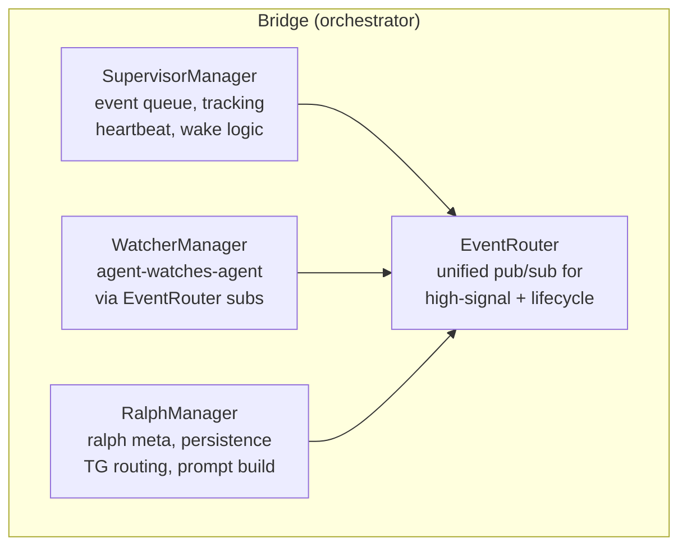
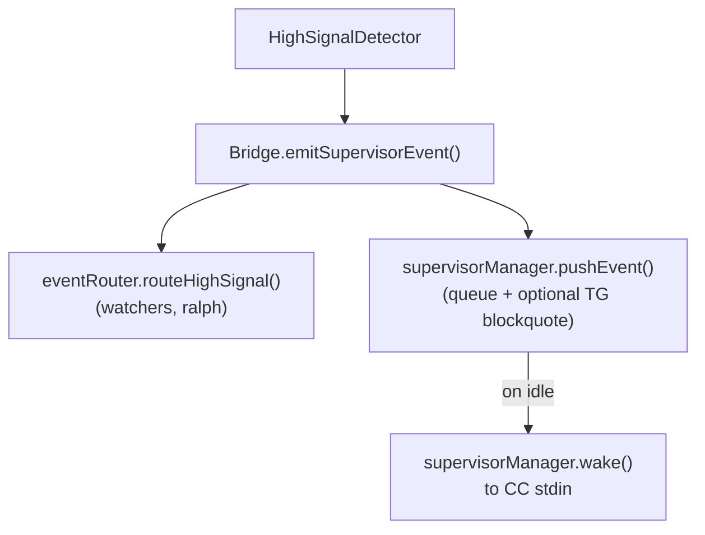
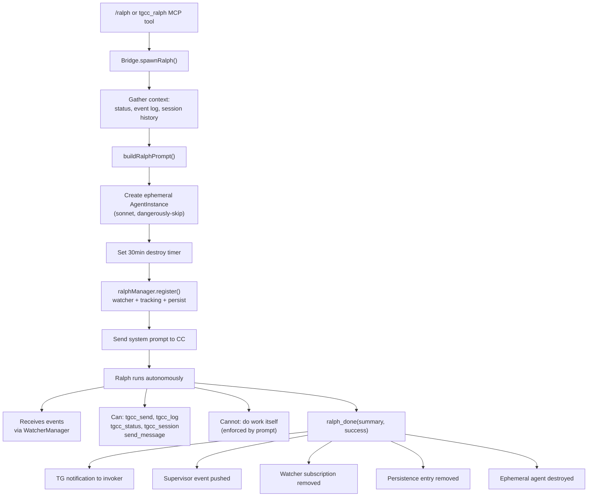
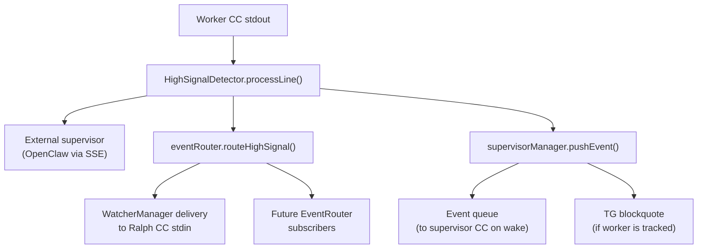

# TGCC Supervision Architecture

> Current state as of 2026-04-07, post Supervision Composability Refactor.

## Overview

TGCC's supervision system lets agents watch, coordinate, and shepherd other agents through a layered architecture of four composable modules. Every supervision feature—event routing, worker tracking, agent-watches-agent, and Ralph completion shepherds—is built from the same primitives.



## Layer 1: EventRouter

**File:** `src/event-router.ts`

The foundation. A typed pub/sub system that routes two categories of events:

| Category | Examples | Source |
|----------|----------|--------|
| **High-signal** | `build_result`, `failure_loop`, `stuck`, `task_milestone`, `git_commit`, `budget_alert` | HighSignalDetector in Bridge |
| **Lifecycle** | `turn_complete`, `process_exited`, `agent_destroyed` | Bridge process management |

### Subscription model

```typescript
interface Subscription {
  subscriberId: string;          // unique per subscriber
  watchAgentIds: Set<string>;    // empty = wildcard (all agents)
  eventTypes: Set<string>;       // empty = wildcard (all events)
  deliver: DeliveryFn;           // callback(subscriberId, event)
  includeReply: boolean;         // include CC reply snippet on turn_complete
}
```

Subscribers can filter by agent ID, event type, or both. The matching logic checks both the RoutableEvent's `type` field (e.g. `'high_signal'`) and its `event` field (e.g. `'build_result'`), so a subscriber filtering on `'build_result'` catches it regardless of transport category.

### Why it matters

Before this refactor, event routing was scattered across Bridge: a `trackedWorkers` Set, a `watchedBy` Map on AgentInstance, direct calls to `notifyWatchers()`, and ad-hoc supervisor queue pushes. EventRouter unifies all of these into one subscription registry. Adding a new event consumer is now a single `subscribe()` call.

## Layer 2: SupervisorManager

**File:** `src/supervisor.ts`

Manages the **native supervisor agent**—the one designated in config as `config.supervisor`. This is the "boss" CC instance that can orchestrate all workers.

### Responsibilities

| Feature | Mechanism |
|---------|-----------|
| **Event queue** | Buffers up to 20 events. When the supervisor CC is idle and events accumulate, `wake()` drains them into CC's stdin as `[Worker events since last turn]` blocks. |
| **Worker tracking** | `trackedWorkers: Set<string>` — workers whose events also appear as TG blockquotes in the supervisor's chat in real-time. Controlled via `tgcc_track`/`tgcc_untrack` MCP tools. |
| **Heartbeat** | Periodic timer that, when tracked workers exist and supervisor is idle, sends a status summary (state, context%, cost, last activity per worker) to wake the supervisor. |
| **Wake logic** | Mutes supervisor TG output during event delivery (so the "here are your events" message doesn't echo to TG), then unmutes after CC processes them. |

### Flow: event → supervisor



## Layer 3: WatcherManager

**File:** `src/watcher.ts`

Generic agent-watches-agent. Any agent can watch any other agent. Ralph is a consumer of this system, not a special case baked into it.

### How it works

`addWatcher()` creates an EventRouter subscription with ID `watcher:<watcherId>:<targetAgentId>`. The delivery callback formats the event and writes it to the watcher's CC stdin:

| Event | Formatted as |
|-------|-------------|
| `turn_complete` | `[turn_complete] Agent foo · $0.18 (error)\nReply: "first 300 chars..."` |
| `process_exited` | `[process_exited] Agent foo CC process exited` |
| `agent_destroyed` | `[agent_exited] Agent foo was destroyed` |
| High-signal | `[build_result] ✅ Build succeeded` |

### Self-healing

If a delivery fires and the watcher agent no longer exists, the subscription auto-removes itself. This prevents leaked subscriptions from accumulating.

### Current consumers

Only RalphManager currently creates watchers. But the system is general-purpose—any agent could watch another with a single `addWatcher()` call.

## Layer 4: RalphManager

**File:** `src/ralph.ts`

Ralph is a **completion shepherd**: an ephemeral sonnet agent whose sole job is to monitor a worker until it finishes a task, then self-destruct.

### Lifecycle



### Persistence

Ralphs survive TGCC restarts. State is persisted to `~/.tgcc/ralphs.json`:

```typescript
interface PersistedRalph {
  ralphId: string;
  meta: { targetAgentId, invokerChatId, invokerAgentId };
  prompt: string;
  createdAt: number;   // epoch ms
  timeoutMs: number;   // max lifetime
}
```

On `Bridge.start()`, `restoreRalphs()` loads persisted ralphs, filters expired ones, checks that target agents still exist, and re-spawns with fresh CC sessions and remaining timeout. The original `ralphId` is preserved via `ralphIdOverride`.

### Default prompt

`/ralph` (no arguments) defaults to: *"Ensure the worker completes its current task successfully. Infer the goal from the session history and event log below."* The system prompt already includes the worker's recent session history and event log, so Ralph has full context to infer the task.

### TG message routing

Ralph has no TG bot of its own. When Ralph calls `send_message`, RalphManager routes it to the **invoker's** TG chat, prefixed with "🐕 Ralph:". This keeps Ralph's reports in the conversation where they're useful.

## Capability System

**Files:** `src/cc-process.ts`, `src/mcp-server.ts`

Instead of a binary `isSupervisor` flag, agents receive a set of capabilities via the `TGCC_CAPABILITIES` environment variable (comma-separated). The MCP server reads these and gates tool availability:

| Capability | Grants access to | Who gets it |
|-----------|------------------|-------------|
| `*` | Everything | Native supervisor |
| `manage` | `tgcc_kill`, `tgcc_session`, `tgcc_ralph` | Supervisor, Ralph |
| `observe` | `tgcc_track`, `tgcc_untrack` | Supervisor, Ralph |
| `schedule` | `tgcc_cron` | Supervisor |
| `watch:self` | `ralph_done` | Ralph only |
| `basic` | (no gated tools yet — future) | Ralph |
| *(none)* | Base tools only: `send_file/image/message/voice`, `notify_supervisor`, `supervisor_exec/notify`, `tgcc_agents/status/send/log/spawn/destroy` | All workers |

```typescript
// mcp-server.ts
const CAPABILITIES = new Set((process.env.TGCC_CAPABILITIES ?? '').split(',').filter(Boolean));
const hasCap = (cap: string) => CAPABILITIES.has('*') || CAPABILITIES.has(cap);

// bridge.ts
private getAgentCapabilities(agentId: string): string[] {
  if (agentId === this.nativeSupervisorId) return ['*'];
  if (this.ralphManager.isRalph(agentId)) return ['observe', 'manage', 'watch:self', 'basic'];
  return [];
}
```

## Event Flow: Complete Picture

A single high-signal event from a worker touches multiple systems:



A lifecycle event (turn_complete, process_exited) follows the same path through EventRouter but is emitted directly by Bridge rather than HighSignalDetector.

## Composition Possibilities

The modular architecture enables several extensions without touching existing code:

### 1. Worker-watches-worker

WatcherManager is not Ralph-specific. A supervisor could set up peer monitoring:

```typescript
watcherManager.addWatcher({
  watcherId: 'frontend-agent',
  targetAgentId: 'backend-agent',
  includeReply: true,
  meta: { reason: 'api-contract-sync' },
});
```

The frontend agent would receive events whenever the backend agent completes a turn or triggers a high-signal event, enabling coordinated parallel development.

### 2. Custom event filters

EventRouter subscriptions support `eventTypes` filtering. An agent could subscribe only to `build_result` and `failure_loop` events, ignoring everything else:

```typescript
eventRouter.subscribe({
  subscriberId: 'ci-monitor',
  watchAgentIds: new Set(),  // all agents
  eventTypes: new Set(['build_result', 'failure_loop']),
  deliver: (id, event) => { /* alert logic */ },
  includeReply: false,
});
```

### 3. Tiered supervision

The capability system already supports hierarchies. A "team lead" agent could receive `['manage', 'observe']` without `schedule` or `*`, giving it control over workers and ralph spawning but not cron jobs or full supervisor powers.

### 4. Ralph chains

Since Ralph has the `manage` capability, a Ralph could theoretically spawn another Ralph to watch a different worker. The persistence system would handle both independently.

### 5. Pluggable event consumers

Any new feature that needs to react to agent events just subscribes to EventRouter. Examples:
- **Slack/Discord integration**: Subscribe to all events, format and post to a channel
- **Metrics collector**: Count events by type for dashboards
- **Auto-scaler**: Watch for `context_pressure` events and trigger session compaction

### 6. Scoped capability bundles

The `basic` capability exists but gates nothing yet. It's a hook for future worker-visible tools that should be available to Ralph but not arbitrary ephemeral agents.

## File Map

| File | Lines | Role |
|------|-------|------|
| `src/event-router.ts` | ~120 | Pub/sub event routing |
| `src/supervisor.ts` | ~180 | Native supervisor management |
| `src/watcher.ts` | ~130 | Agent-watches-agent |
| `src/ralph.ts` | ~230 | Ralph lifecycle + persistence |
| `src/bridge.ts` | ~4500 | Orchestrator (creates and wires managers) |
| `src/mcp-server.ts` | ~900 | MCP tool registration + capability gating |
| `src/cc-process.ts` | ~400 | CC process spawning + MCP config generation |

## Design Principles

1. **Bridge delegates, managers own.** Bridge creates agent instances and wires dependencies. Managers own their domain logic and state.

2. **EventRouter is the spine.** All inter-agent event delivery goes through one pub/sub system. No ad-hoc notification paths.

3. **Capabilities, not roles.** Agents get fine-grained capability sets, not binary flags. This scales to new roles without refactoring the gating logic.

4. **Persistence at the edges.** Only RalphManager persists state (because ralph is ephemeral and survives restarts). SupervisorManager and WatcherManager are reconstructed from config and ralph restoration.

5. **Self-healing subscriptions.** Watchers auto-remove when their target or the watcher itself is destroyed. No leaked subscriptions.
