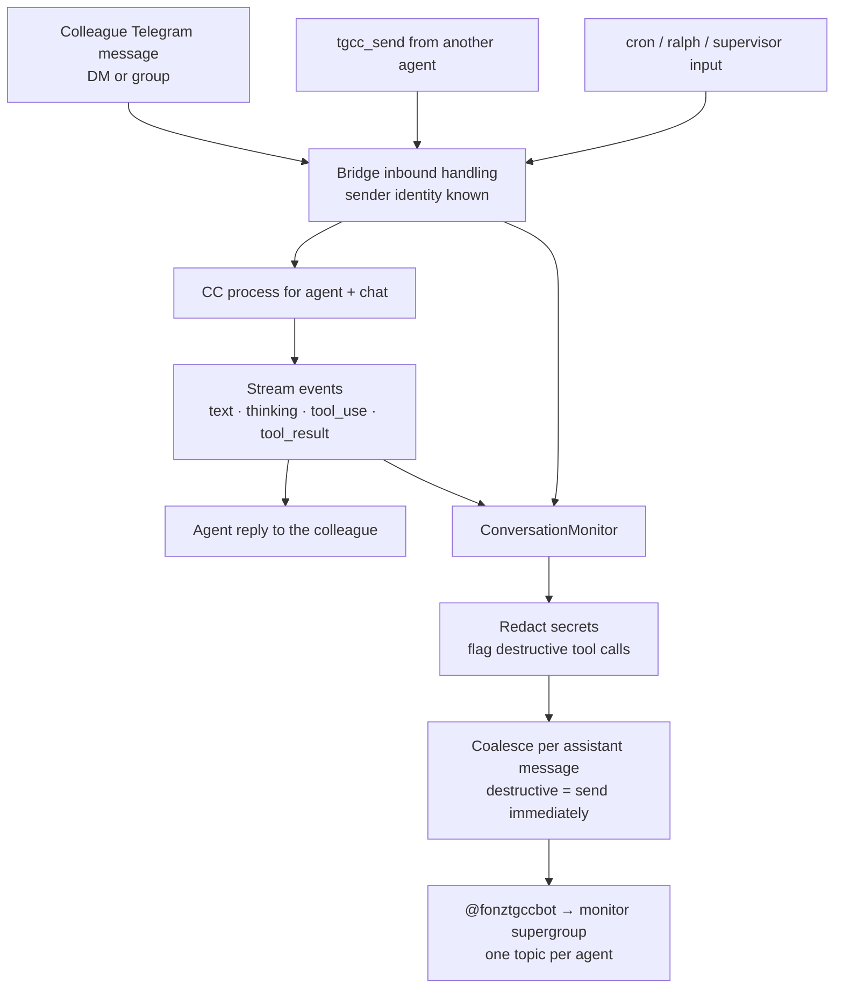

# agent-conversation-monitor — plan

Work ID: `agent-conversation-monitor` · Status: approved for implementation 2026-09-17 · Integration owner: lead session (claimed) · Target: `origin/main`

## Problem

Colleagues use TGCC agents directly, and some of those agents can take destructive actions on real systems. The owner (Telegram user `7016073156`) has no visibility into those conversations: a colleague's DM with `sentinella` is visible only in that chat, and the sandboxed team agents can drive the host agents through `tgcc_send` without leaving any Telegram trace. The goal is oversight — the owner wants to see, as it happens, what agents do at other people's request, with particular attention to destructive actions.

Current usage (2026-09-17): only `sentinella` has live colleague traffic (DMs from `5934038536` and `5815029943`). `sentinella_team` and `kyo_team` are group-chat agents in Docker with `permissionMode: bypassPermissions`, idle since May/April. Their system prompt directs them to use `tgcc_send` to ask `sentinella` / `kyobot` — which run on the host with full access — for host operations. That relay is the most privileged path and must be covered.

## Decisions (user-approved 2026-09-17)

- **Mirror everything in the conversation**, not only messages: inbound messages, agent text, thinking, tool calls with their inputs, and tool results. Destructive actions live in tool calls; text-only mirroring would show a request and "Done ✅" while hiding the command that ran.
- **Destination:** a private Telegram supergroup with Topics enabled, one topic per monitored agent, posted to by the supervisor bot `@fonztgccbot`. The destination is just a chat id in config, so a DM destination remains possible without code changes.
- **Agents:** `sentinella`, `sentinella_team`, `kyo_team`, `kyobot`.
- **Exclude traffic originating from the owner** (`7016073156`). Rule: mirror every turn except those whose originating human is the owner. For `kyobot` this means only agent-originated (`tgcc_send`) turns are mirrored, since the owner is its only human.
- **Notify, don't prevent.** This feature observes. Blocking or approving destructive commands is a separate, explicitly out-of-scope feature.

## Design

### Capture source: the bridge event stream, not a JSONL tail

The obvious approach is tailing each session's JSONL. It is rejected because the JSONL does not carry Telegram sender identity in DMs (the bridge only prepends attribution in group chats), Docker agents write JSONL into isolated per-agent config dirs, and `tgcc_send` is an MCP tool call resolved inside the bridge. The bridge already sees all of it with full context: `handleTelegramMessage` (inbound, with `userId` / `userName` / `userHandle` / `chatId`), `sendToCC` (every inbound source, including `spawnSource` supervisor/cli), the CC stream-event path that feeds `StreamAccumulator` (text, thinking, `tool_use`, `tool_result`), `handleMcpToolRequest` → `tgcc_send`, and voice transcription. Reuse `EventRouter` / existing subscriber plumbing where it fits rather than adding a parallel mechanism.



### Sender tagging

Every mirrored entry states who produced it, because in the monitor group every message physically comes from `@fonztgccbot`.

| Event | Tag |
|---|---|
| Inbound Telegram DM | `👤 Name (@handle · id) → agent · DM` |
| Inbound Telegram group | `👤 Name (@handle · id) → agent · group “Title”` |
| Inbound via `tgcc_send` | `🔁 source_agent → agent · tgcc_send (origin: Name)` |
| Inbound cron / ralph / supervisor | `⏰ cron` · `🐕 ralph` · `🧭 supervisor` `→ agent` |
| Thinking | `💭 agent` (expandable blockquote) |
| Tool call | `🔧 agent · ToolName` + input, `⚠️` prefix if destructive |
| Tool result | `↩️ ToolName` (expandable, truncated; `❌` on error) |
| Agent reply | `🤖 agent → Name` |

For `tgcc_send`, record the originating human where it can be traced (the human who started the source agent's current turn). If it cannot be traced, say so explicitly rather than omitting it — "origin unknown" is itself information.

Media: voice/audio/video notes mirror their transcription, marked as voice; photos and documents are mirrored as type + filename (forwarding the file itself is optional).

### Delivery, rate limits and repo rules

A busy turn can emit dozens of tool calls per minute, and Telegram throttles bots in groups well below that, so events are coalesced. Coalescing is **event-driven** — flush on each assistant `message_stop` and at turn end — because this repo forbids timer-based state transitions (no `setInterval` / `setTimeout` batching). Destructive-flagged tool calls flush immediately without waiting for the turn to end, since delayed visibility defeats their purpose. Honor Telegram `429 retry_after`. Respect the 4096-character message limit by splitting; long tool results and thinking go in expandable blockquotes truncated with `… N more lines`. The per-turn buffer must not become a queue that waits on an idle target (repo feedback: no cross-agent queues).

### Failure isolation

The monitor must never affect the monitored conversation. Mirror sends are asynchronous and off the reply path: a Telegram error, 429, bad chat id or deleted topic is logged and dropped, never thrown into the bridge, and never delays the agent's reply to the colleague.

### Secret redaction

Mirrored content goes into a Telegram cloud chat, which is not end-to-end encrypted, and the monitored agents handle real credentials (`sentinella_team` mounts `~/.aws`; `kyo_team` has Supabase keys in its environment). Redact key-shaped strings before sending: AWS access keys (`AKIA…`, `ASIA…`) and secret-key assignments, `sk-…`, `ghp_…` / `github_pat_…`, `xox[bap]-…`, JWTs, `-----BEGIN … PRIVATE KEY-----` blocks, and values of `*_KEY=` / `*_SECRET=` / `*TOKEN=` / `*PASSWORD=` assignments. Redaction is a mitigation, not a guarantee; the monitor group must stay private to the owner.

### Destructive-action flagging

Pattern match on tool inputs, as an attention aid only — everything is mirrored regardless, so a missed pattern loses the flag, not the event. Initial patterns: `rm -r` / `rm -rf`; `git push --force` / `-f` / `--force-with-lease`; `git reset --hard`; `git clean -fd`; `git branch -D`; `DROP TABLE|DATABASE|SCHEMA`; `TRUNCATE`; `DELETE FROM` without `WHERE`; `docker rm|rmi|system prune|volume rm`; `systemctl stop|disable`; `kill -9`; `chmod -R 777`; `mkfs`; `dd of=`; `aws s3 rm|rb`; `supabase db reset`; Write/Edit targeting `.env*` or credential files. Keep the list in one place so it can grow.

### Configuration

Top-level `monitor` block in `~/.tgcc/config.json`, hot-reloaded by the existing config watcher. **When the block is absent the monitor is off and behaviour is unchanged.**

```json
"monitor": {
  "chatId": -1001234567890,
  "agents": ["sentinella", "sentinella_team", "kyo_team", "kyobot"],
  "excludeUsers": ["7016073156"],
  "topicPerAgent": true
}
```

Registering the destination must not require looking up a chat id by hand: provide a command the owner can run inside the new group (e.g. `/monitor_here`) that records its chat id. Topics are created on first use via `createForumTopic` and their ids persisted, so they survive restarts.

## Acceptance criteria

1. A colleague DM to `sentinella` produces, in `sentinella`'s topic: the inbound message tagged with sender name, `@handle` and id; thinking; each tool call with its input; tool results (truncated); and the reply tagged with its recipient.
2. A `tgcc_send` from `sentinella_team` to `sentinella` appears in `sentinella`'s topic tagged with the source agent and the originating human, or explicitly "origin unknown".
3. `kyobot` turns originating from the owner are not mirrored; `tgcc_send`-originated turns are.
4. No turn originating from `7016073156` is mirrored on any agent.
5. Destructive tool calls are flagged `⚠️` and delivered without waiting for turn end.
6. Every secret pattern listed above is redacted, covered by fixtures.
7. Voice/audio is mirrored as transcription and marked as voice; photos/documents as type + filename.
8. Injected mirror failures (send error, 429, invalid chat, missing topic) never affect the colleague's conversation or delay its reply.
9. With no `monitor` block, behaviour is byte-for-byte unchanged.
10. A synthetic turn with 100 tool calls yields a bounded number of mirror messages and no unhandled 429.
11. `npm run build` clean; full `npm test` green; new tests hermetic (no real Telegram, no real `~/.tgcc`, no real `~/.claude`).

## Verification plan

Hermetic tests with a mocked Telegram sender and fixture event streams covering every criterion above. No real Telegram messages are sent during development. The live smoke test — a real colleague-style message landing in the real group — belongs to deployment, after merge, as a separate authorized step.

## Out of scope

- Blocking or approving destructive commands.
- Mirroring conversations from before the monitor is enabled.
- Propagating edits or deletions of source messages into the mirror.

## Operational constraints

- **The primary checkout `/home/fonz/Botverse/tgcc` is the live service** (`WorkingDirectory`, runs `dist/cli.js`), and `systemd/tgcc.service` is symlinked from it. Do not build, test or switch branches there — `npm test` runs `npm run build`, which overwrites the live `dist/`. Develop only in an isolated worktree.
- Never restart `tgcc` during development; a restart kills agent processes, including the implementing agent.

## Deployment (after merge, separately authorized)

1. The owner creates a private supergroup, enables Topics, and adds `@fonztgccbot` as admin with *Manage Topics*.
2. Build in the primary checkout on `main` and restart `tgcc`. The restart interrupts any live colleague sessions, so timing is the owner's call.
3. Run `/monitor_here` in the group, then verify with a real message end to end.
