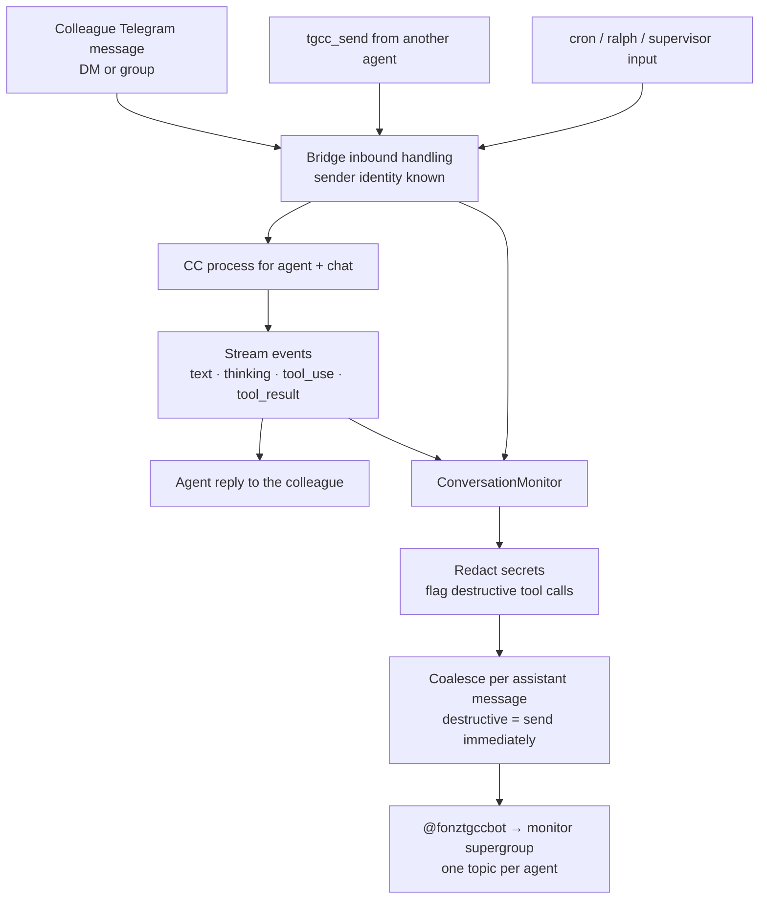

# agent-conversation-monitor — plan

Work ID: `agent-conversation-monitor` · Status: approved for implementation 2026-09-17 · Integration owner: lead session (claimed) · Target: `origin/main`

**Revised 2026-09-17** after the lead's implementation review found three problems that needed fixing before a tester gets involved: the delivery design in §Delivery below didn't hold up under Telegram's real per-chat rate limit (my own planning gap, not an implementation miss — see §Delivery and revised criterion 10); `/monitor_here` had no authorization check beyond whichever bot's generic `allowedUsers` happened to apply, so a colleague could reach it through a different agent's bot (see §Configuration and new criterion 12); and the monitor destination chat itself was never excluded from being treated as a conversation, so anything the owner typed there would be spawned as a CC prompt inside the mirror feed (see new criterion 13). All three are fixed on branch `feat/agent-conversation-monitor`; this document is updated to match what was actually built, since the plan is the tracked source of truth and the original text was wrong on these points. See `LOG.md` for the full account of what changed and why.

## Problem

Colleagues use TGCC agents directly, and some of those agents can take destructive actions on real systems. The owner (Telegram user `7016073156`) has no visibility into those conversations: a colleague's DM with `sentinella` is visible only in that chat, and the sandboxed team agents can drive the host agents through `tgcc_send` without leaving any Telegram trace. The goal is oversight — the owner wants to see, as it happens, what agents do at other people's request, with particular attention to destructive actions.

Current usage (2026-09-17): only `sentinella` has live colleague traffic (DMs from `5934038536` and `5815029943`). `sentinella_team` and `kyo_team` are group-chat agents in Docker with `permissionMode: bypassPermissions`, idle since May/April. Their system prompt directs them to use `tgcc_send` to ask `sentinella` / `kyobot` — which run on the host with full access — for host operations. That relay is the most privileged path and must be covered.

## Decisions (user-approved 2026-09-17)

- **Mirror everything in the conversation**, not only messages: inbound messages, agent text, thinking, tool calls with their inputs, and tool results. Destructive actions live in tool calls; text-only mirroring would show a request and "Done ✅" while hiding the command that ran.
- **Destination:** a private Telegram supergroup with Topics enabled, one topic per monitored agent, posted to by the supervisor bot `@fonztgccbot`. The destination is just a chat id in config, so a DM destination remains possible without code changes.
- **Agents:** `sentinella`, `sentinella_team`, `kyo_team`, `kyobot`.
- **Exclude traffic originating from the owner** (`7016073156`). Rule: mirror every turn except those whose originating human is the owner. For `kyobot` this means only agent-originated (`tgcc_send`) turns are mirrored, since the owner is its only human.
- **Notify, don't prevent.** This feature observes. Blocking or approving destructive commands is a separate, explicitly out-of-scope feature.

## Design

### Capture source: the bridge event stream, not a JSONL tail

The obvious approach is tailing each session's JSONL. It is rejected because the JSONL does not carry Telegram sender identity in DMs (the bridge only prepends attribution in group chats), Docker agents write JSONL into isolated per-agent config dirs, and `tgcc_send` is an MCP tool call resolved inside the bridge. The bridge already sees all of it with full context: `handleTelegramMessage` (inbound, with `userId` / `userName` / `userHandle` / `chatId`), `sendToCC` (every inbound source, including `spawnSource` supervisor/cli), the CC stream-event path that feeds `StreamAccumulator` (text, thinking, `tool_use`, `tool_result`), `handleMcpToolRequest` → `tgcc_send`, and voice transcription. Reuse `EventRouter` / existing subscriber plumbing where it fits rather than adding a parallel mechanism.



### Sender tagging

Every mirrored entry states who produced it, because in the monitor group every message physically comes from `@fonztgccbot`.

| Event | Tag |
|---|---|
| Inbound Telegram DM | `👤 Name (@handle · id) → agent · DM` |
| Inbound Telegram group | `👤 Name (@handle · id) → agent · group “Title”` |
| Inbound via `tgcc_send` | `🔁 source_agent → agent · tgcc_send (origin: Name)` |
| Inbound cron / ralph / supervisor | `⏰ cron` · `🐕 ralph` · `🧭 supervisor` `→ agent` |
| Thinking | `💭 agent` (expandable blockquote) |
| Tool call | `🔧 agent · ToolName` + input, `⚠️` prefix if destructive |
| Tool result | `↩️ ToolName` (expandable, truncated; `❌` on error) |
| Agent reply | `🤖 agent → Name` |

For `tgcc_send`, record the originating human where it can be traced (the human who started the source agent's current turn). If it cannot be traced, say so explicitly rather than omitting it — "origin unknown" is itself information.

Media: voice/audio/video notes mirror their transcription, marked as voice; photos and documents are mirrored as type + filename (forwarding the file itself is optional).

### Delivery, rate limits and repo rules

**Revised 2026-09-17 — the original design below was wrong; kept struck through for context, replaced by the "As built" design that follows.**

~~A busy turn can emit dozens of tool calls per minute, and Telegram throttles bots in groups well below that, so events are coalesced. Coalescing is event-driven — flush on each assistant `message_stop` and at turn end. Destructive-flagged tool calls flush immediately without waiting for the turn to end. Honor Telegram `429 retry_after`. Respect the 4096-character message limit by splitting.~~ This met the letter of "coalesced" but missed the point: one message per `message_stop` meant 100 tool calls became 102 Telegram messages, and Telegram throttles a bot to roughly **20 messages/minute per chat** — with every monitored agent posting into the *same* destination chat (forum topics share that one chat's limit), a busy turn built a backlog of 5+ minutes, and a queued ⚠️ destructive call arrived minutes late, defeating the reason the flag exists. Delivery was also chained **per agent**, so several busy agents fought over the one shared per-chat limit and multiplied 429s instead of sharing capacity. Nothing bounded the backlog either.

**As built:** delivery is serialized by a single pump loop **per destination chat**, not per agent:
- Turn-boundary events (assistant `message_stop`, tool result, turn end) still flush into a per-agent buffer exactly as before — this part of the original design was right and is unchanged, still purely event-driven, no timers beyond the existing 429 `retry_after` wait.
- That buffer moves into a shared **outbound backlog**, keyed by agent (topic). A single pump loop drains it: while a send is in flight, new blocks simply accumulate; the send's *completion* is the event that triggers picking what to send next. This stays event-driven — no polling, no fixed-interval pacing.
- Each pick **packs** one agent's pending backlog into as few messages as fit the 3500-char budget (Telegram's 4096 limit minus overhead), so message count follows how much fits per send and the rate limit's own pace, rather than the raw event count.
- Blocks are either **critical** (destructive ⚠️ tool calls, inbound human messages, `tgcc_send` origins, an agent's final reply — anything that carries "who asked for what") or **routine** (thinking, non-destructive tool calls, tool results, non-final narration text). Critical blocks are packed ahead of routine content on every send and are **never** collapsed or dropped — a pending ⚠️ therefore always escapes the very next time its agent's backlog is chosen, never stuck behind a pile of routine calls.
- Each agent's backlog is capped at 50 routine blocks; past the cap the **oldest routine blocks** collapse into one summary line grouped by tool/kind (e.g. `… 37 routine events omitted: Read ×20, Grep ×12, Bash ×5`), bounding memory under sustained bursts without ever touching critical content.
- Forum-topic ids are persisted keyed by **destination chat id**, not just agent id, so a destination change never reuses a stale thread id from the old chat against the new one.
- If Topics are unavailable in the destination (disabled, or the bot lacks `can_manage_topics`), the monitor falls back to posting without a thread and warns **once**, not per message.

Respect the 4096-character message limit by packing (as above); long tool results and thinking go in expandable blockquotes truncated with `… N more lines`. Honor Telegram `429 retry_after` exactly as before (same idiom `StreamAccumulator` already uses). The outbound backlog is capped and drains eagerly as each send settles — it is not the kind of cross-agent queue the repo's "no queues" feedback targets, since it never waits on the *monitored agent's* state (idle or otherwise); it only waits on Telegram's own send completing.

### Failure isolation

The monitor must never affect the monitored conversation. Mirror sends are asynchronous and off the reply path: a Telegram error, 429, bad chat id or deleted topic is logged and dropped, never thrown into the bridge, and never delays the agent's reply to the colleague.

### Secret redaction

Mirrored content goes into a Telegram cloud chat, which is not end-to-end encrypted, and the monitored agents handle real credentials (`sentinella_team` mounts `~/.aws`; `kyo_team` has Supabase keys in its environment). Redact key-shaped strings before sending: AWS access keys (`AKIA…`, `ASIA…`) and secret-key assignments, `sk-…`, `ghp_…` / `github_pat_…`, `xox[bap]-…`, JWTs, `-----BEGIN … PRIVATE KEY-----` blocks, and values of `*_KEY=` / `*_SECRET=` / `*TOKEN=` / `*PASSWORD=` assignments. Redaction is a mitigation, not a guarantee; the monitor group must stay private to the owner.

### Destructive-action flagging

Pattern match on tool inputs, as an attention aid only — everything is mirrored regardless, so a missed pattern loses the flag, not the event. Initial patterns: `rm -r` / `rm -rf`; `git push --force` / `-f` / `--force-with-lease`; `git reset --hard`; `git clean -fd`; `git branch -D`; `DROP TABLE|DATABASE|SCHEMA`; `TRUNCATE`; `DELETE FROM` without `WHERE`; `docker rm|rmi|system prune|volume rm`; `systemctl stop|disable`; `kill -9`; `chmod -R 777`; `mkfs`; `dd of=`; `aws s3 rm|rb`; `supabase db reset`; Write/Edit targeting `.env*` or credential files. Keep the list in one place so it can grow.

### Configuration

Top-level `monitor` block in `~/.tgcc/config.json`, hot-reloaded by the existing config watcher. **When the block is absent the monitor is off and behaviour is unchanged.**

```json
"monitor": {
  "chatId": -1001234567890,
  "agents": ["sentinella", "sentinella_team", "kyo_team", "kyobot"],
  "excludeUsers": ["7016073156"],
  "topicPerAgent": true,
  "ownerUserId": "7016073156"
}
```

**Revised 2026-09-17 — added `ownerUserId` (required once the block exists).** It is explicit and separate from `excludeUsers` — deliberately not inferred from it, since `excludeUsers` can contain other ids too and inferring "the owner" from it would be guesswork rather than an explicit identity check. It's the sole authorization anchor for `/monitor_here` (see below).

Registering the destination must not require looking up a chat id by hand: provide a command the owner can run inside the new group (e.g. `/monitor_here`) that records its chat id. Topics are created on first use via `createForumTopic` and their ids persisted (keyed by destination chat id — see §Delivery), so they survive restarts.

**`/monitor_here` authorization (added 2026-09-17):** the command was originally reachable on *every* agent's bot, gated only by that bot's own generic `allowedUsers` — for `sentinella`, that includes the colleagues (`5934038536`, `5815029943`) the monitor exists to watch. Either could have run `/monitor_here` in their own DM or a group and moved the destination away from the owner, silently disabling oversight. Fixed with two layers: (1) the command is only ever wired up — both as a live handler and in the BotFather menu — on the bot whose agent id matches `config.supervisor`; other bots don't parse it as a command at all. (2) The shared command handler independently re-checks that the caller's Telegram user id equals `monitor.ownerUserId`, never trusting routing alone. A destination change is never silent: the *previous* destination (if one existed and is different) is notified that it no longer receives mirrored conversations, without being told the new chat id.

**Monitor destination chat exclusion (added 2026-09-17):** the owner is necessarily an allowed user of whichever bot posts into the destination (to run `/monitor_here`), and that bot has to be a group admin to manage topics — so it receives every message sent in that chat. Without an exclusion, anything typed there (a note, a reply to a mirrored message) would be spawned as an ordinary CC prompt inside the mirror feed itself. The destination chat now ignores every inbound message and every command except `/monitor_here` and a read-only `/status`.

## Acceptance criteria

1. A colleague DM to `sentinella` produces, in `sentinella`'s topic: the inbound message tagged with sender name, `@handle` and id; thinking; each tool call with its input; tool results (truncated); and the reply tagged with its recipient.
2. A `tgcc_send` from `sentinella_team` to `sentinella` appears in `sentinella`'s topic tagged with the source agent and the originating human, or explicitly "origin unknown".
3. `kyobot` turns originating from the owner are not mirrored; `tgcc_send`-originated turns are.
4. No turn originating from `7016073156` is mirrored on any agent.
5. Destructive tool calls are flagged `⚠️` and delivered without waiting for turn end.
6. Every secret pattern listed above is redacted, covered by fixtures.
7. Voice/audio is mirrored as transcription and marked as voice; photos/documents as type + filename.
8. Injected mirror failures (send error, 429, invalid chat, missing topic) never affect the colleague's conversation or delay its reply.
9. With no `monitor` block, behaviour is byte-for-byte unchanged.
10. **Revised 2026-09-17.** A synthetic turn with 100 tool calls yields a message count that scales with Telegram's rate limit and how much content fits per message, not with the raw event count (packing), and never a message per event; delivery for one destination chat is serialized (never more than one send in flight at a time across agents sharing it, so separate agents don't multiply 429s against the same limit); a destructive ⚠️ block queued behind a large pending routine backlog for the same agent is still delivered in the very next message for that agent, not after the backlog drains; the per-agent backlog is bounded (oldest routine content collapses into one counted summary line past a fixed cap, with critical content — destructive calls, inbound messages, `tgcc_send` origins, replies — never collapsed or dropped); and no unhandled 429 crashes or stalls the pipeline.
11. `pnpm run build` clean; full `pnpm test` green; new tests hermetic (no real Telegram, no real `~/.tgcc`, no real `~/.claude`).
12. **Added 2026-09-17.** `/monitor_here` run by a colleague (e.g. one of `sentinella`'s `allowedUsers`) on any agent's bot other than the native supervisor's is rejected and never changes the destination — including when that colleague's Telegram user id happens to coincide with `monitor.ownerUserId`. `/monitor_here` run by anyone other than `monitor.ownerUserId`, even on the supervisor's bot, is rejected. `/monitor_here` is absent from the command menu (`setMyCommands`) on every bot except the supervisor's. A successful destination change notifies the previous destination (when one existed and differs) that it no longer receives mirrored conversations, without revealing the new chat id.
13. **Added 2026-09-17.** A plain text message, photo, voice note, or non-`monitor_here`/`status` command sent in the monitor destination chat is never forwarded to a CC process and never spawns a reply there — it's silently ignored, regardless of which agent's bot happens to be posting into that chat.

## Verification plan

Hermetic tests with a mocked Telegram sender and fixture event streams covering every criterion above. No real Telegram messages are sent during development. The live smoke test — a real colleague-style message landing in the real group — belongs to deployment, after merge, as a separate authorized step.

## Out of scope

- Blocking or approving destructive commands.
- Mirroring conversations from before the monitor is enabled.
- Propagating edits or deletions of source messages into the mirror.

## Operational constraints

- **The primary checkout `/home/fonz/Botverse/tgcc` is the live service** (`WorkingDirectory`, runs `dist/cli.js`), and `systemd/tgcc.service` is symlinked from it. Do not build, test or switch branches there — `pnpm test` runs `pnpm run build`, which overwrites the live `dist/`. Develop only in an isolated worktree. This repo's package manager is **pnpm** (`pnpm-lock.yaml`) — use it, not `npm`, when installing or running scripts in a worktree.
- Never restart `tgcc` during development; a restart kills agent processes, including the implementing agent.

## Deployment (after merge, separately authorized)

1. The owner creates a private supergroup, enables Topics, and adds `@fonztgccbot` as admin with *Manage Topics*.
2. **Revised 2026-09-17 — added a bootstrap step.** Before starting `tgcc` with the new config, add a `monitor` block to `~/.tgcc/config.json` with at least `ownerUserId` (the owner's Telegram user id) and `chatId` set to some placeholder (e.g. the owner's own DM id) — `/monitor_here` updates `chatId` in place but refuses to act at all unless `ownerUserId` is already configured (see §Configuration). Add `agents` and `excludeUsers` here too, or fill them in later.
3. Build in the primary checkout on `main` and restart `tgcc`. The restart interrupts any live colleague sessions, so timing is the owner's call.
4. Run `/monitor_here` in the group **using the supervisor's bot** (`@fonztgccbot`) as the owner — it's rejected from any other bot or any other user, per criterion 12 — then verify with a real message end to end.
